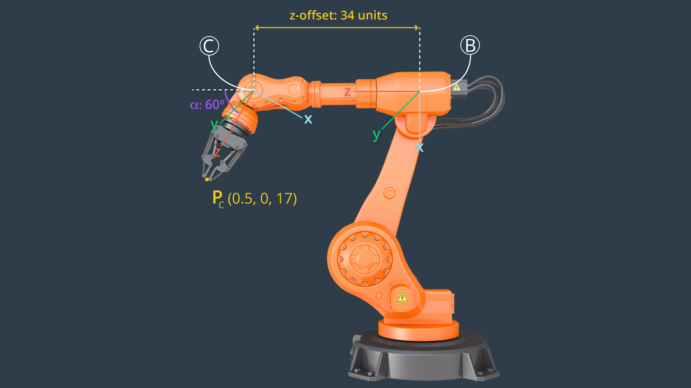
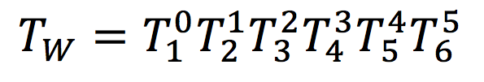
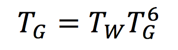
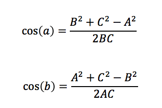

# Project: Kinematics Pick & Place
### Vincent FORTINEAU, R&D Engineer at ALPhANOV, Bordeaux, France

#### Project due : 23rd May 2018
---

## Goals and steps of the project

1. Set up your ROS Workspace.
2. Download or clone the [project repository](https://github.com/udacity/RoboND-Kinematics-Project) into the ***src*** directory of your ROS Workspace.  
3. Experiment with the forward_kinematics environment and get familiar with the robot.
4. Launch in [demo mode](https://classroom.udacity.com/nanodegrees/nd209/parts/7b2fd2d7-e181-401e-977a-6158c77bf816/modules/8855de3f-2897-46c3-a805-628b5ecf045b/lessons/91d017b1-4493-4522-ad52-04a74a01094c/concepts/ae64bb91-e8c4-44c9-adbe-798e8f688193).
5. Perform Kinematic Analysis for the robot following the [project rubric](https://review.udacity.com/#!/rubrics/972/view).
6. Fill in the `IK_server.py` with your Inverse Kinematics code. 


[//]: # (Image References)

[image1]: ./misc/misc1.png
[image2]: ./misc/misc3.png
[image3]: ./misc/misc2.png
[DH_param_expl]: ./misc/denavit-hartenberg-parameter-definitions.png
[DH_schema]: ./misc/schema_DH.png
[hom_tf_mat]: ./misc/eq_tf_matrix.png
[ind_tf]: ./misc/Individual_tf_matrix.png
[TF_equ_wrist]: ./misc/Tf-mult-wrist.png
[TF_equ_EE]: ./misc/Tf-mult-EE.png
[1st_elem]: ./misc/1st_elem_matrix_T0_G.png
[joints1_2_3]: ./misc/joints1_2_3_expl.png
[theta3]: ./misc/theta3_expl.png
[cosines]: ./misc/law_of_cosines.png
[T3_6]: ./misc/matrix_T3_6.png
[success_reach]: ./misc/successful_reach2.gif
[failed_reach]: ./misc/failed_reach.gif
[correcting_fail]: ./misc/successful_reach3.png
[go_to_trash]: ./misc/successful_drop.gif
[result]: ./misc/4out_of5.png

#### [Evaluation criteria](https://review.udacity.com/#!/rubrics/972/view)  

## Table of Contents

* [Kinematic Analysis](#part1)
	* [1. DH Parameters](#1-1)
	* [2. Transformation Matrices](#1-2)
	* [3. Inverse Kinematics](#1-3)
		* [Inverse Position Kinematics](#1-3-a)
		* [Inverse Orientation Kinematics](#1-3-b)
* [Project Implementation](#part2)
	* [1. Script implementation](#2-1)
		* [Transformation matrices](#2-1-a)
		* [Wrist center](#2-1-b)
		* [Inverse Kinematic](#2-1-c)	 
	* [2. Efficiency](#2-2)
	* [3. Results](#2-3)

### Kinematic Analysis <a name="part1"></a>

_In order to control Kuka [**polyarticulated robot**](https://en.wikipedia.org/wiki/Articulated_robot), we need to manage its inverse kinematic, that is solving the joint angles, for a given position of the gripper. To do so, we first need a better understanding of its forward kinematic, an then we will dive into the inverse kinematic._

<center>



<sub>_Udacity, 2018_</sub>

</center>

#### 1. DH Parameters <a name="1-1"></a>

The [Denavit Hartenberg](https://en.wikipedia.org/wiki/Denavit–Hartenberg_parameters) (DH) representation between two joints is well summed up with the following figure (*courtesy of Udacity*).

<center>

![Explanation][DH_param_expl]
<sub>_Udacity, 2018_</sub>
</center>

* α<sub>i-1</sub>, twist angle
* a<sub>i-1</sub>, link length
* d<sub>i</sub>, link offset
* θ<sub>i</sub>, joint angle

The DH representation of the [Kuka KR210](https://www.robots.com/robots/kuka-kr-210) is shown below :

<center>

![Denavit-Hartenberg representation][DH_schema]

<sub>_Vincent F., 2018_</sub>
</center>

To find out the value of the constants a<sub>n-1</sub>, d<sub>n</sub> and α<sub>n-1</sub>, we need to match the _Universal Robotic Description Format_ (URDF) file provided for the KR210 and our DH representation. 

<center>

Joint name | Parent link | Child link | x   | y   | z 
---        | ---         | ---        | --- | --- | ---
joint_1    | base_link   | link_1     | 0   |  0  | 0.33
joint_2    | link_1      | link_2     | 0.35|  0  | 0.42
joint_3    | link_2      | link_3     | 0   |  0  | 1.25
joint_4    | link_3      | link_4     | 0.96|  0  | -0.054
joint_5    | link_4      | link_5     | 0.54|  0  | 0
joint_6    | link_5      | link_6     |0.193|  0  | 0
gripper_joint | link_6   | gripper_link|0.11|  0  | 0

</center>

In the URDF file, each joint is defined according to its parent. The reference of its parent is set to the joint center and not to the joint origin - **Eg**. *joint 1 origin is shown on the upper figure as O<sub>1</sub>, but in the URDF file, the center of the joint is different*. 

Once each parameter is matched, we obtain the following values :

<center>

Links| α<sub>i-1</sub> (rad) | a<sub>i-1</sub> (m) | d<sub>i-1</sub> (m) | θ<sub>i</sub> (rad)
:---:|:----:|:----:|:------:|:------:
0->1 | 0    | 0    | 0.33 + 0.42 | q1
1->2 | -π/2 | 0.35 | 0      | q2 - π/2 
2->3 | 0    | 1.25 | 0      | q3
3->4 | -π/2 |-0.054| 0      | q4
4->5 |  π/2 | 0 |0.96 + 0.54| q5
5->6 | -π/2 | 0    | 0      | q6
6->G | 0    | 0 |0.193 + 0.11| q7 = 0

</center>

#### 2. Transformation Matrices <a name="1-2"></a>

The homogenous transformation between two axis is constructed as a sequence of four basic transformations, two rotations and two translations using the DH parameters (_c_ : cos, _s_ : sin, _i_ : axis number) :

<center>

![homogenous transform][hom_tf_mat]

</center>

Since the Kuka robot has 6 rotative joints, 6 matrices will need to be multiplied to obtain the wrist pose. Moreover a translation must be done to reach the grapper, or end effector.

<center>




![ind_tf]    

</center>

Since the final matrix is quite huge, I will only provide the first element _r_<sub>11</sub> as an indicator:

![1st_elem]

The computation has been done with the help of [sympy](http://www.sympy.org/en/index.html), doing this by hand would have been quite a labor.

#### 3. Inverse Kinematics <a name="1-3"></a>

The Kuka KR210 is designed with a **spherical wrist**, which means that its last 3 joint axes intersect in a single point. This allows us to kinematically decouple the position and orientation of the end effector. 

We can divide the inverse kinematics problem into two steps :

* The **wrist position**
* The **orientation of the grapper**

#### Inverse Position Kinematics <a name="1-3-a"></a>

Here we want to determine the angles of joints 1, 2 and 3 knowing the grapper position.

First we need to transpose the grapper pose to the wrist position. Let's call _n_ the orthonormal vector of the gripper orientation along the z axis.

* _w<sub>x</sub> = p<sub>x</sub> - (d<sub>6</sub> + l).n<sub>x</sub>_
* _w<sub>y</sub> = p<sub>y</sub> - (d<sub>6</sub> + l).n<sub>y</sub>_
* _w<sub>z</sub> = p<sub>z</sub> - (d<sub>6</sub> + l).n<sub>z</sub>_

_p<sub>x</sub>, p<sub>y</sub>, p<sub>z</sub>_  are the gripper coordinates, _w<sub>x</sub>, w<sub>y</sub>, w<sub>z</sub>_ are the wrist coordinates and _l_ is the lenght of the gripper.
 
Now that we can deduce the wrist position, we can determine θ<sub>1</sub>, θ<sub>2</sub> and θ<sub>3</sub> the respective angle of the joints 1, 2 and 3.

From a **bird's eyes view** of the robot, we easily deduce θ<sub>1</sub>, it actually follows the same logic given in the inverse kinematic example in lesson 11.

_**θ<sub>1</sub>** = atan2(w<sub>y</sub>, w<sub>x</sub>)_

θ<sub>2</sub> and θ<sub>3</sub> are trickier, the following figure showing a triangle between joint 2, 3 and 4 helps.

<center>

![alt text][image2]

<sub>_Udacity, 2018_</sub>

![joints1_2_3]

<sub>_Udacity, 2018, modified by Vincent F._</sub>
 
</center> 
 
First we want to establish the side of the triangle, _A_, _B_, and _C_.

_**A**_ is the lenght of the link between joint 3 and joint 4, _**C**_ is also the lenght of the link between joint 2 and joint 3. _**B**_ is the lenght between joint 2 and the wrist. Knowing the wrist position, we need to substract the lenght between the base and joint 2 to deduce _B_.

* _A = d<sub>4</sub>_
* _B<sup>2</sup> = ((x<sub>wc</sub><sup>2</sup> + y<sub>wc</sub><sup>2</sup>)<sup>1/2</sup> - a<sub>1</sub>)<sup>2</sup> + (z<sub>wc</sub> - d<sub>1</sub>)<sup>2</sup>_
* _C = a<sub>2</sub>_

To compute the angle _a_, _b_ and _c_ we can use the [law of cosines](https://en.wikipedia.org/wiki/Law_of_cosines)

<center>



</center>

With those 2 angles, we can compute θ<sub>2</sub> and θ<sub>3</sub> :

* _**θ<sub>2</sub>** = π/2 - a - atan2(y, x)_
* _**θ<sub>3</sub>** = π/2 - b - asin(a<sub>3</sub>, d<sub>4</sub>)_

<center>

with _x = (x<sub>wc</sub><sup>2</sup> + y<sub>wc</sub><sup>2</sup>)<sup>1/2</sup> - a_, and _y = z<sub>wc</sub> - d<sub>1</sub>_

</center>

The second term in _θ<sub>3</sub>_ comes from the sag between joint 3 and 5. It cannot be observed on the pictures above, the figure below offer a better understanding of the sag.

<center>

![theta3]

<sub>_Vincent F., 2018_</sub>

</center>


#### Inverse Orientation Kinematics <a name="1-3-b"></a>

Here we want to determine the angles of joint 4, 5 and 6.

This can be done knowning the matrix **_T3\_6_**, that can be computed by post multiplying the transformation matrices between joint 4 and joint 6, as shown in [_Transformation Matrices_](#1-2).

The matrix was computed using [sympy](http://www.sympy.org/en/index.html) library ( _s<sub>4</sub> = sin(θ<sub>4</sub>)_ ): 

![][T3_6]

_**θ<sub>4</sub>**_ is straight forward using _r<sub>13</sub>_ and _r<sub>33</sub>_ of the matrix above so is _**θ<sub>6</sub>**_ using _r<sub>21</sub>_ and _r<sub>22</sub>_ . _**θ<sub>5</sub>**_ can be found using [Euler angles](https://en.wikipedia.org/wiki/Euler_angles), for example using _r<sub>21</sub>_ and _r<sub>22</sub>_ or _r<sub>13</sub>_ and _r<sub>33</sub>_ to get _sin(q<sub>5</sub>)_. Let's call _α_ a constant, then :

* _**θ<sub>4</sub>** = atan2(α.sin(θ<sub>4</sub>), α.cos(θ<sub>4</sub>)) = atan2(r<sub>33</sub>, -r<sub>13</sub>)_
* _**θ<sub>5</sub>** = atan2(α.sin(θ<sub>5</sub>), α.cos(θ<sub>5</sub>)) = atan2((r<sub>21</sub><sup>2</sup> + r<sub>22</sub><sup>2</sup>)<sup>1/2</sup>, r<sub>23</sub>)_ 
* _**θ<sub>5</sub>** = atan2(α.sin(θ<sub>6</sub>), α.cos(θ<sub>6</sub>)) = atan2(-r<sub>22</sub>, r<sub>21</sub>)_

For more details on ```atan2(y,x)``` function see [here](https://en.wikipedia.org/wiki/Atan2).


### Project Implementation <a name="part2"></a>

#### 1.`IK_server.py` script implementation <a name="2-1"></a>

##### Transformation matrices <a name="2-1-a"></a>

```python
def transformMatrix(alpha, a, theta, d):
    
    r11 = cos(theta)
    r12 = -sin(theta)
    r13 = 0
    tx = a
    r21 = sin(theta) * cos (alpha)
    r22 = cos(theta) * cos (alpha)
    r23 = -sin(alpha)
    ty = -sin(alpha) * d
    r31 = sin(theta) * sin(alpha)
    r32 = cos(theta) * sin(alpha)
    r33 = cos(alpha)
    tz = cos(alpha) * d
    
    tf_mat = Matrix([[r11, r12, r13, tx],
                     [r21, r22, r23, ty],
                     [r31, r32, r33, tz],
                     [ 0 ,  0 ,  0 , 1 ]])
    
    return tf_mat
```

```python
# Create individual transformation matrices

T0_1 = transformMatrix(alpha0, a0, q1, d1).subs(s) 
T1_2 = transformMatrix(alpha1, a1, q2, d2).subs(s)
T2_3 = transformMatrix(alpha2, a2, q3, d3).subs(s)
T3_4 = transformMatrix(alpha3, a3, q4, d4).subs(s)
T4_5 = transformMatrix(alpha4, a4, q5, d5).subs(s)
T5_6 = transformMatrix(alpha5, a5, q6, d6).subs(s)
T6_G = transformMatrix(alpha6, a6, q7, d7).subs(s)

```

##### Wrist center <a name="2-1-b"></a>

```python
R_G = Rot_z * Rot_y * Rot_x # spherical wrist rotation 3DoF

# This rotation is used to correct the difference between DH repr. and
# the robot repr. in moveit software
Rcomp_G = Rot_z.sub(y, np.pi) * Rot_y.sub(p, -np.pi/2)

R_G = R_G * Rcomp_G
R_G = R_G.sub({'r' : roll, 'p' : pitch, 'y' : yaw})

T_G = Matrix([[px], [py], [pz]])

WC = T_G - s[d7] * R_G[:,2] # Equation described in Lesson 11, 18. IK
```

##### Inverse Kinematic <a name="2-1-c"></a>

Law of Cosines

```python
def cos_law(side1, side2, opside): # return cos(gamma)
    return (side1**2 + side2**2 - opside**2) / (2 * side1 * side2)
```

Triangle ABC

```python
# sides
A = s[d4]
C = s[a2]
B = sqrt((sqrt(px**2 + py**2) - a1)**2 + (pz - s[d1])**2)
# angles
a = acos(cos_law(B, C, A))
b = acos(cos_law(A, C, B))
```

```python
theta1 = atan2(WC[1], WC[0]) 
theta2 = np.pi/2 - a - atan2(pz -s[d1], sqrt(px**2 + py**2) - s[a1])
theta3 = np.pi/2 - b - asin(s[a3]/s[d4])

theta4 = atan2(T3_6[2,2], -T3_6[0,2])
theta5 = atan2(sqrt(T3_6[1,1]**2 + T3_6[1,0]**2), T3_6[1,2])
theta6 = atan2(-T3_6[1,1], T3_6[1,0])
```

#### 2. Efficiency <a name="2-2"></a>

**Forward Kinematic computation**

For the forward kinematic, the function ```sympy.simplify()``` takes lot of ressources. To earn some time, it should be called once. _For the inverse kinematic, this part of the code should be commented since it is only necessary for non numerical computation._

_Split_

```python
T0_2 = simplify(T0_1 * T1_2)
T0_3 = simplify(T0_2 * T2_3)
T0_4 = simplify(T0_3 * T3_4)
T0_5 = simplify(T0_4 * T4_5)
T0_6 = simplify(T0_5 * T5_6)
T0_G = simplify(T0_6 * T6_G)
```

_Grouped_

```python
T0_G = simplify(T0_1 * T1_2 * T2_3 * T3_4 * T4_5 * T5_6 * T6_G)
```

_Speed result_

```python
runfile('/Users/Vincent/.spyder/temp.py', wdir='/Users/Vincent/.spyder')
Split: 30.90 s
Grouped: 15.86 s
```

**Inverse Kinematic computation**

For the computation of **T3_6** matrix, one way to earn some computation time is to use the transpose function instead of the inverse function. This is only possible if the matrix is [orthogonal](https://en.wikipedia.org/wiki/Orthogonal_matrix). The computation for inverting a matrix is indeed more complex, than switching element like in a transpose.

```python
# Inverse function
R3_6 = R0_3.inv("LU") * R_G
# Transpose function
R3_6 = R0_3.T * R_G
```

```
Inverse computation time: 0.0055s
Transpose computation time: 0.0008s
```

**Numpy**

Sympy is a really great library for non numerical computation of matrices, but for numerical calculus, it is not very efficient.

Switching every element from sympy to [numpy](http://www.numpy.org) was actually the most efficient move. 

Below are some of the changes that needs to be made to switch to numpy:

```python
# sympy matrix
a = sp.Matrix([[]])
# numpy matrix
a = np.array([[]])

# sympy symbol need to be replaced with numerical values
a1, a2 = sp.symbols('a1:3')

# trigonometric functions and sqrt need to be switch to numpy
sp.cos(a)
sp.atan2(y,x)
np.cos(a)
np.arctan2(y,x)

# column extraction sp
R_G[:,2]
# column extraction np
R_G[:,[2]]

```
In the end the time earned is non negligeable.

With Sympy:

```
robond@udacity:~/catkin_ws/src/RoboND-Kinematics-Project$ python IK_debug.py

Total run time to calculate joint angles from pose is 0.6599 seconds
Wrist error for x position is: 0.00000046
Wrist error for y position is: 0.00000032
Wrist error for z position is: 0.00000545
Overall wrist offset is: 0.00000548 units
```
With Numpy:

```
robond@udacity:~/catkin_ws/src/RoboND-Kinematics-Project$ python IK_debug.py

Total run time to calculate joint angles from pose is 0.0005 seconds
Wrist error for x position is: 0.26684000
Wrist error for y position is: 0.01667000
Wrist error for z position is: 0.14257000
Overall wrist offset is: 0.30299782 units

```

_But this time efficiency switch has a price with the accuracy, numpy allows us to be 1000 times quicker but with 10000 times less accuracy._

#### 3. Results <a name="2-3"></a>

We can see below the different state the robot is taking to reach and grab the blue cylinder.

<center>

![success_reach]

</center>

If the action move to reach position and grab the target are executed too quickly, the robot pushes back the target. By waiting the stabilization of the first move, and then launching the grab action, this kind of mistake only occured at one place. Described further in the results.

<center>

![failed_reach]

</center>

On the following picture you can see that the robot was able to reach the same target as above without pushing it. 

<center>

![correcting_fail]

</center>

We can observe that even if it might not be the most complicated part, dropping the target in the trash is the longuest part of the process.

<center>

![go_to_trash]

</center>

Out of 5 trials, only one failed, the target that appears on the right part of the shelf. The robot keeps hitting this cylinder while processing to its grab move. An other strategy is probably needed to reach this one.

<center>

![result]

</center>

In real time, the total process takes between _1min45s_, and _2min30s_. In simulation time, the process seems to be twice as fast, according to the simulation time indicated in Gazebo.


To reach better performances, one idea could be to compute several solutions for all joints angle, this would allow the program to choose between the different options the one that minimize the movement.
