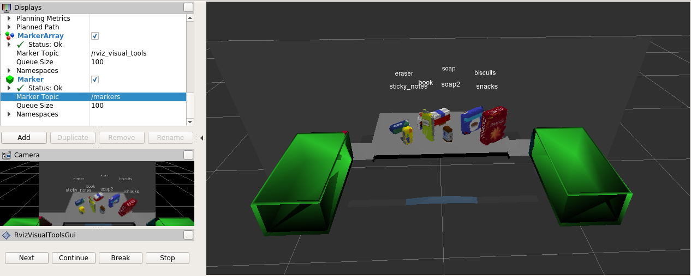

# Project: 3D Perception
### Vincent FORTINEAU, R&D Engineer at ALPhANOV, Bordeaux, France

#### Project due : 12nd July 2018
---

## Goals and steps of the project

1. Set up your ROS Workspace.
2. Download or clone the [project repository]() into the **src** directory of your ROS Workspace.
3. Extract features and train an SVM model on new objects (see `pick_list_*.yaml` in `/pr2_robot/config/` for the list of models you'll be trying to identify). 
4. Write a ROS node and subscribe to `/pr2/world/points` topic. This topic contains noisy point cloud data that you must work with.
5. Use filtering and RANSAC plane fitting to isolate the objects of interest from the rest of the scene.
6. Apply Euclidean clustering to create separate clusters for individual items.
7. Perform object recognition on these objects and assign them labels (markers in RViz).
8. Calculate the centroid (average in x, y and z) of the set of points belonging to that each object.
9. Create ROS messages containing the details of each object (name, pick_pose, etc.) and write these messages out to `.yaml` files, one for each of the 3 scenarios (`test1-3.world` in `/pr2_robot/worlds/`).  [See the example `output.yaml` for details on what the output should look like.](https://github.com/udacity/RoboND-Perception-Project/blob/master/pr2_robot/config/output.yaml)  
10.  You must have correctly identified :
	* 100% of objects from `pick_list_1.yaml` for `test1.world`
	* 80% of items from `pick_list_2.yaml` for `test2.world`
	* 75% of items from `pick_list_3.yaml` in `test3.world`

## Extra Challenges: Complete the Pick & Place
11. To create a collision map, publish a point cloud to the `/pr2/3d_map/points` topic and make sure you change the `point_cloud_topic` to `/pr2/3d_map/points` in `sensors.yaml` in the `/pr2_robot/config/` directory. This topic is read by Moveit!, which uses this point cloud input to generate a collision map, allowing the robot to plan its trajectory.  Keep in mind that later when you go to pick up an object, you must first remove it from this point cloud so it is removed from the collision map!
8. Rotate the robot to generate collision map of table sides. This can be accomplished by publishing joint angle value(in radians) to `/pr2/world_joint_controller/command`
9. Rotate the robot back to its original state.
10. Create a ROS Client for the “pick_place_routine” rosservice.  In the required steps above, you already created the messages you need to use this service. Checkout the [PickPlace.srv](https://github.com/udacity/RoboND-Perception-Project/tree/master/pr2_robot/srv) file to find out what arguments you must pass to this service.
11. If everything was done correctly, when you pass the appropriate messages to the `pick_place_routine` service, the selected arm will perform pick and place operation and display trajectory in the RViz window
12. Place all the objects from your pick list in their respective dropoff box and you have completed the challenge!
13. Looking for a bigger challenge?  Load up the `challenge.world` scenario and see if you can get your perception pipeline working there!

#### [Evaluation criteria](https://review.udacity.com/#!/rubrics/1067/view) 

[//]: # (Image References)


## Table of Contents

* [Environment](#part0)
	* [1. Libraries](#0-1) 
	* [2. Supporting functions](#0-2)
	* [3. Program structure](#0-3)
* [Point cloud pipeline](#part1)
	* [1. Point cloud filtering](#1-1)
	* [2. Features extraction using clustering](#1-2)
	* [3. Objects recognition](#1-3)
* [Extra-challenge](#part2)
	* [1. Robot rotation](#2-1)
	* [2. Collision map](#2-2)
	* [3. Robot pick action](#2-3) 
* [Pick and Place results](#part3)
	* [1. Recognition results, and yaml output](#3-1)
	* [2. Pick and place results](#3-1)

### Environment <a name="part0"></a>

_Giving a robot the ability to locate an object in a cluttered environment, pick it up and then move it to some other locations is a challenge at the forefront of the robotics industry today. This project is highly inspired by the [Amazon Robotics Challenge](https://www.amaronrobotics.com/#/)._

_[PR2](www.willowgarage.com/pages/pr2/overview) robot, from [Willow Garage](https://en.wikipedia.org/wiki/Willow_Garage), was choosen to pick up a set of objects on a table, to 2 different locations according to a given list._

<center>


<sub>(C) _Michael Memminger_</sub>

</center>

#### 1. Libraries <a name="0-1"></a>

```python
# Import modules

import numpy as np
import sklearn
from sklearn.preprocessing import LabelEncoder
import pickle
import yaml

import rospy
import tf
from geometry_msgs.msg import Pose
from std_msgs.msg import Float64
from std_msgs.msg import Int32
from std_msgs.msg import String
from visualization_msgs.msg import Marker
from sensor_stick.marker_tools import *
from sensor_stick.msg import DetectedObjectsArray
from sensor_stick.msg import DetectedObject
from pr2_robot.srv import *
from rospy_message_converter import message_converter
```

* **numpy** is mainly used for the mathematic functions.
* **sklearn** is used for SVM machine learning algorithm.
* **pickle** helps to save and load data to files
* **yaml** helps to save files in this format
* **rospy** is probably the most important module for ROS python bindings
* **tf** is actually a ROS library for transforms, _unused for now_


#### 2. Supporting functions <a name="0-2"></a>

```python
from sensor_stick.srv import GetNormals
from sensor_stick.features import compute_color_histograms
from sensor_stick.features import compute_normal_histograms
from sensor_stick.pcl_helper import *
```

```python
def compute_normal_histograms(normal_cloud):
    norm_x_vals = []
    norm_y_vals = []
    norm_z_vals = []

    for norm_component in pc2.read_points(normal_cloud,
                                          field_names = ('normal_x', 'normal_y', 'normal_z'),
                                          skip_nans=True):
        norm_x_vals.append(norm_component[0])
        norm_y_vals.append(norm_component[1])
        norm_z_vals.append(norm_component[2])

    # TODO: Compute histograms of normal values (just like with color)
    x_hist = np.histogram(norm_x_vals, bins=32, range=(0, 256))
    y_hist = np.histogram(norm_y_vals, bins=32, range=(0, 256))
    z_hist = np.histogram(norm_z_vals, bins=32, range=(0, 256))

    # TODO: Concatenate and normalize the histograms
    hist_features = np.concatenate((x_hist[0], y_hist[0], z_hist[0])).astype(np.float64)

    # Generate random features for demo mode.  
    # Replace normed_features with your feature vector
    normed_features = hist_features / np.sum(hist_features)

    return normed_features
```

```python
# Helper function to get surface normals
def get_normals(cloud):
    get_normals_prox = rospy.ServiceProxy('/feature_extractor/get_normals', GetNormals)
    return get_normals_prox(cloud).cluster
```

```python
# Helper function to create a yaml friendly dictionary from ROS messages
def make_yaml_dict(test_scene_num, arm_name, object_name, pick_pose, place_pose):
    yaml_dict = {}
    yaml_dict["test_scene_num"] = test_scene_num.data
    yaml_dict["arm_name"]  = arm_name.data
    yaml_dict["object_name"] = object_name.data
    yaml_dict["pick_pose"] = message_converter.convert_ros_message_to_dictionary(pick_pose)
    yaml_dict["place_pose"] = message_converter.convert_ros_message_to_dictionary(place_pose)
    return yaml_dict
```

```python
# Helper function to output to yaml file
def send_to_yaml(yaml_filename, dict_list):
    data_dict = {"object_list": dict_list}
    with open(yaml_filename, 'w') as outfile:
        yaml.dump(data_dict, outfile, default_flow_style=False)
```

#### 3. Program structure <a name="0-3"></a>

```pcl_callback(pcl_msg)``` function contains the point cloud pipeline described below, the function is called through a ROS subscriber as follows:

```python
camera_pcl_sub = rospy.Subscriber("/pr2/world/points", pc2.PointCloud2, pcl_callback, queue_size=1)
```

The ```pr2_mover(object_list)``` function load parameters and request PickPlace service, it is called at the end of ```pcl_callback()```function.

For the machine learning algorithm, the trained models are imported in the main using pickle:

```python
model = pickle.load(open('model.sav', 'rb'))
clf = model['classifier']
encoder = LabelEncoder()
encoder.classes_ = model['classes']
scaler = model['scaler']
```

This training set is created with two python functions described in [3. Objects recognition](#1-3).

### Point cloud pipeline <a name="part1"></a>

#### 1. Point cloud filtering <a name="1-1"></a>

##### Statistical Outlier Filtering

The point cloud detected by the RGBD camera is quite messy, it contains lots of unexpected points that must be cleaned and filtered, they mostly come from measurement errors and corrupt the point cloud.

<center>


<sub> Unfiltered Point Cloud, (C) _Vincent F. (2018)_</sub>

</center>

One way to filter thoses points is to use a [statistical outlier filter](pointclouds.org/documentation/tutorials/statistical_outlier.php), for every point the mean distance of its neighbors is computed. All the points whose mean distances are outside a given standard deviation are deleted from the dataset.

```python
outlier_filter = cloud.make_statistical_outlier_filter() # filter object
    
nb_neighboring_pts = 40
outlier_filter.set_mean_k(nb_neighboring_pts)
    
threshold_scale = 0.20
outlier_filter.set_std_dev_mul_thresh(threshold_scale)
    
cloud_filtered = outlier_filter.filter()
```

Here, I experimentaly determined the standart deviation threshold and the number of neighbors. The 2 values defined for the algorithm could be optimized with further experimentation. 

<center>


<sub>Filtered Point Cloud, (C) _Vincent F. (2018)_</sub>

</center>

##### Voxel Grid Downsampling

RGBD camera provides an abundantly dense point cloud, such a rich data would slow any computation. A smart downsampling could help a lot with the computation time without damaging the data. 

A [voxel](https://en.wikipedia.org/wiki/Voxel) is the pixel equivalent in 3 dimensions. We can define a voxel dimension, such that the data would have an optimized density with the downsampling taking the average value of every points within a voxel.

```python
vox = cloud_filtered.make_voxel_grid_filter() # VoxelGrid filter object
    
LEAF_SIZE = 0.01 # unit size is meter
vox.set_leaf_size(LEAF_SIZE, LEAF_SIZE, LEAF_SIZE)

# Call the filter function to obtain the resultant downsampled point cloud
cloud_filtered = vox.filter()
```

<center>


<sub>Filtered Point Cloud, (C) _Vincent F. (2018)_</sub>

</center>

A good voxel dimension could be a square with a side within a centimeter, since the objects we want to recognize are around 5 cm<sup>2</sup>. _Again, this value can probably be optimized through experimentation._

##### PassThrough Filter

Since we know the region of interest (ROI) location in our environment, that is on the table, it is quite easy to extract irrelevant data.

Indeed, knowing the table dimension, and the global size of the object on it, we can apply a Pass Through Filter on the 'z' axis to get rid of the ground and other undesired features.

We can also use the same filter on the 'y' and 'x' axis, but here, the 'x' axis is unecessary (already filtered with the 'z' axis).

```python
passthrough_z = cloud_filtered.make_passthrough_filter() # PassThrough filter object

# Assign axis and range to the passthrough filter object.
filter_axis = 'z'
passthrough_z.set_filter_field_name(filter_axis)
axis_min = 0.6 # top of the table
axis_max = 1.0
passthrough_z.set_filter_limits(axis_min, axis_max)

# Finally use the filter function to obtain the resultant point cloud. 
cloud_filtered = passthrough_z.filter()
```

```python
passthrough_y = cloud_filtered.make_passthrough_filter() # PassThrough filter object

# Assign axis and range to the passthrough filter object.
filter_axis = 'y'
passthrough_y.set_filter_field_name(filter_axis)
axis_min = -0.5
axis_max = 0.5
passthrough_y.set_filter_limits(axis_min, axis_max)

# Finally use the filter function to obtain the resultant point cloud. 
cloud_filtered = passthrough_y.filter()
```    


#### 2. Features extraction and clustering <a name="1-2"></a>

##### RANSAC Plane Segmentation

[RANSAC](https://en.wikipedia.org/wiki/Random_sample_consensus) stands for _RANdom SAmple Consensus_, it is a non deterministic algorithm that helps finding outliers knowing a mathematical model. The results are therefore given with a certain probability that increases with the number of iterations.

Even if we got rid of most of the table, in order not to damage data, the top of the table could not be deleted with the previous method. 

The point cloud library (PCL) provides the [SAC model of a plan](docs.pointclouds.org/1.8.1/classpcl_1_1_sample_consensus_model_plane.html). It can therefore be used to separate the top of the table, that fits the model of a plan, and the object that are lying on top.

The sensitivity of the algorithm can be set with a threshold, here choosen as 10 cm.

```python
seg = cloud_filtered.make_segmenter() # segmentation object

# Set the plane model 
seg.set_model_type(pcl.SACMODEL_PLANE) # plane model to reach the table
seg.set_method_type(pcl.SAC_RANSAC)

# Max distance for a point to be considered fitting the model
max_distance = 0.01
seg.set_distance_threshold(max_distance)
```


##### Inliers and outliers

Once the RANSAC method is used, it is easy to obtain either the table or the objects. Since we used the model of the table to compute the algorithm, the objects will be the **outliers**.

```python
# Call the segment function to obtain set of inlier indices and model coefficients
inliers, coefficients = seg.segment()

cloud_table = cloud_filtered.extract(inliers, negative=False)
cloud_objects = cloud_filtered.extract(inliers, negative=True) # outliers
```

<center>


<sub>Outliers after RANSAC method, (C) _Vincent F. (2018)_</sub>

</center>

##### Euclidean Clustering

Also called [**DBSCAN**](https://en.wikipedia.org/wiki/DBSCAN) algorithm for Density-Based Spatial Clustering of Application with Noise, this method regroup clusters of points that are within a threshold distance.

3 parameters must be chosen according to what we are expecting from the clusters : 

* Tolerance : 3 cm
* Minimal size of a cluster : 100 points
* Maximal size of a cluster : 2500 points

The minimal size avoid having small cluster from noise that where not filtered. The maximal size is not that relevant in our case, since we cleared the point cloud from all large undesired data.

```python
# Convert PCL RGB data to PCL colorless data
cloud_objects_xyz = XYZRGB_to_XYZ(cloud_objects)
tree =  cloud_objects_xyz.make_kdtree()
    
# Create a cluster extraction object
ec = cloud_objects_xyz.make_EuclideanClusterExtraction()
    
# Set tolerances for distance threshold 
# as well as minimum and maximum cluster size (in points)
ec.set_ClusterTolerance(0.03) # 3 cm
ec.set_MinClusterSize(100) # modify this according to the min size of the target
ec.set_MaxClusterSize(2500) # modify this according to the max size of the target
    
# Search the k-d tree for clusters
ec.set_SearchMethod(tree)
    
# Extract indices for each of the discovered clusters
cluster_indices = ec.Extract()
```

```python
# TODO: Create Cluster-Mask Point Cloud to visualize each cluster separately
#Assign a color corresponding to each segmented object in scene
cluster_color = get_color_list(len(cluster_indices))

color_cluster_point_list = []

for j, indices in enumerate(cluster_indices):
    for i, indice in enumerate(indices):
        color_cluster_point_list.append([cloud_objects_xyz[indice][0],
                                        cloud_objects_xyz[indice][1],
                                        cloud_objects_xyz[indice][2],
                                         rgb_to_float(cluster_color[j])])

#Create new cloud containing all clusters, each with unique color
cluster_cloud = pcl.PointCloud_PointXYZRGB()
cluster_cloud.from_list(color_cluster_point_list)
```

<center>


<sub>Euclidean Clustering, (C) _Vincent F. (2018)_</sub>

</center>

#### 3. Objects recognition <a name="1-3"></a>

In order to identify the object, we are going to use a machine learning technique. The [SVM](https://en.wikipedia.org/wiki/Support_vector_machine) algorithm, _Support Vector Machines_, can learn from a set of data to make prediction using pattern recognition. 

Since it is a supervised learning, a training set of data with labels must be used. We are going to generate this training set.


<center>


<sub>_Yi Ng, Xin & Rosdi, Bakhtiar & Shahrudin, Shahriza. (2015). Prediction of Antimicrobial Peptides Based on Sequence Alignment and Support Vector Machine-Pairwise Algorithm Utilizing LZ-Complexity. BioMed research international. 2015._</sub>

</center>

##### Training data generation

The file ```capture_features.py```, provided with the first exercices of this class, spawn models in random orientation. The camera captures the point of clouds, then **color and normal histograms** are saved in a file with the corresponding label.

The size of the data set can be modified easily with the number of iterations for each model. At the end, models that do not fit with the expected objects are spawn to complete the data.

To obtain a large set of data, each models was captured with **50 random orientations**.

```python
# Disable gravity and delete the ground plane
    initial_setup()
    labeled_features = []

    for model_name in models:
        spawn_model(model_name)

        for i in range(NB_IT):
            # make five attempts to get a valid a point cloud then give up
            sample_was_good = False
            try_count = 0
            while not sample_was_good and try_count < 5:
                sample_cloud = capture_sample()
                sample_cloud_arr = ros_to_pcl(sample_cloud).to_array()

                # Check for invalid clouds.
                if sample_cloud_arr.shape[0] == 0:
                    print('Invalid cloud detected')
                    try_count += 1
                else:
                    sample_was_good = True

            # Extract histogram features
            chists = compute_color_histograms(sample_cloud, using_hsv=True)
            normals = get_normals(sample_cloud)
            nhists = compute_normal_histograms(normals)
            feature = np.concatenate((chists, nhists))
            labeled_features.append([feature, model_name])

        delete_model()


    pickle.dump(labeled_features, open('training_set.sav', 'wb'))
```

##### SVM Traning

Once we have saved features with matching labels, the machine training comes. Again, a file, ```train_svm.py``` is provided from the previous exercices.

```python
X = np.array(feature_list)
# Fit a per-column scaler
X_scaler = StandardScaler().fit(X)
# Apply the scaler to X
X_train = X_scaler.transform(X)
y_train = np.array(label_list)

# Convert label strings to numerical encoding
encoder = LabelEncoder()
y_train = encoder.fit_transform(y_train)

# Create classifier
clf = svm.SVC(kernel='rbf')

# Set up 5-fold cross-validation
kf = cross_validation.KFold(len(X_train),
                            n_folds=5,
                            shuffle=True,
                            random_state=1)

# Perform cross-validation
scores = cross_validation.cross_val_score(cv=kf,
                                         estimator=clf,
                                         X=X_train, 
                                         y=y_train,
                                         scoring='accuracy'
                                        )
print('Scores: ' + str(scores))
print('Accuracy: %0.2f (+/- %0.2f)' % (scores.mean(), 2*scores.std()))

# Gather predictions
predictions = cross_validation.cross_val_predict(cv=kf,
                                          estimator=clf,
                                          X=X_train, 
                                          y=y_train
                                         )

accuracy_score = metrics.accuracy_score(y_train, predictions)
print('accuracy score: '+str(accuracy_score))

confusion_matrix = metrics.confusion_matrix(y_train, predictions)

class_names = encoder.classes_.tolist()


#Train the classifier
clf.fit(X=X_train, y=y_train)

model = {'classifier': clf, 'classes': encoder.classes_, 'scaler': X_scaler}
```

The kernel used for the SVM classifier is a [Radial Basis Function](https://en.wikipedia.org/wiki/Radial_basis_function_kernel), it gave better results than the linear kernel. Yet, other popular kernels could be tested to try obtaining different results.

The results obtained with the training set of data - _splited between training and testing_ - showed an accuracy of 96% (+/- 4%) which is pretty descent. Both confusion matrices (normalized and non normalized) are shown bellow.

<center>


<sub>SVM Confusion Matrices, (C) _Vincent F. (2018)_</sub>

</center>

##### Predictions

Since the training set shown encouraging results, the next step is to try the training model on the 3 different world examples. First, the model must be loaded, this is done only once in the main function.

```python
# Load Model From disk
model = pickle.load(open('model.sav', 'rb'))
clf = model['classifier']
encoder = LabelEncoder()
encoder.classes_ = model['classes']
scaler = model['scaler']
```

The normal and color histograms must be extracted from every cluster, and a prediction will be made for every cluster.

```python
# Extract histogram features

chists = compute_color_histograms(ros_pcl_cluster, using_hsv=True)
normals = get_normals(ros_pcl_cluster)
nhists = compute_normal_histograms(normals)
feature = np.concatenate((chists, nhists))

# Make the prediction, retrieve the label for the result  
# and add it to detected_objects_labels list
prediction = clf.predict(scaler.transform(feature.reshape(1,-1)))
label = encoder.inverse_transform(prediction)[0]
detected_objects_labels.append(label)
```

Below are shown the results obtained in the provided world.

<center>


<sub>Prediction world 1, (C) _Vincent F. (2018)_</sub>

</center>

A list of **DetectedObject**, regrouping both the label and the point cloud, is generated. This list will then be passed as parameter of the ```pr2_mover``` function, that will proceed to the pick up.

```python
# Add the detected object to the list of detected objects.
do = DetectedObject()
do.label = label
do.cloud = ros_pcl_cluster
detected_objects.append(do)
```

### Extra-challenge <a name="part2"></a>

#### 1. Robot rotation <a name="2-1"></a>

```python
# Rotate PR2 in place to capture side tables for the collision map
    
world_joint_pub.publish(np.pi/2)   
# add some wait function, non blocking if possible
    
world_joint_pub.publish(-np.pi/2)
# add some wait function, non blocking if possible
    
world_joint_pub.publish(0)
# add some wait function, non blocking if possible
```

#### 2. Collision map <a name="2-2"></a>

```python
collision_map_list = []
collision_map_label_list = [] # to be able to extract pcl according to their label
    
for object in object_list:
    pcl_object = ros_to_pcl(object.cloud)
        
    collision_map_label_list.append(object.label)
    collision_map_list.append(pcl_object)
```

#### 3. Robot pick action <a name="2-3"></a>

##### Initialization

The objects list and the boxes position can be read thanks to the ```get_param``` function from ```rospy``` module. This function could be called with success because this parameters where defined in the launch file as follow :

```
<rosparam command="load" file="$(find pr2_robot)/config/dropbox.yaml"/>
<rosparam command="load" file="$(find pr2_robot)/config/pick_list_1.yaml"/>
```

Then from the yaml files regrouping the parameters, we can see for example, that the 2 dropboxes are defined by their group, either 'red' or 'green', their name, 'left' or 'right' and their position given as a 3 elements vector.

```python
# Initialize variables
test_scene_num = Int32()
object_name = String()
arm_name = String()
place_pose = Pose()
pick_pose = Pose()
    
test_scene_num.data = 2 # This value must fit the one in pick_place_project.launch

# Get/Read parameters
# get parameters
object_list_param = rospy.get_param('/object_list')
boxes_param = rospy.get_param('/dropbox')
    
boxes = {}
# Get boxes positions
for i in range(0, 2):
    if boxes_param[i]['group'] == 'red':
        boxes['red'] = boxes_param[i]['position']
            
    elif boxes_param[i]['group'] == 'green':
        boxes['green'] = boxes_param[i]['position']
```

##### Centroïd computation

```python
labels = []
centroids = [] # to be list of tuples (x, y, z)
    
for object in object_list:
    labels.append(object.label)

    # Get the PointCloud for a given object and obtain it's centroid
    points_arr = ros_to_pcl(object.cloud).to_array()
    centroids.append(np.mean(points_arr, axis=0)[:3])
```

##### Arm assignment and pick position

```python
if object_group == 'red':
    arm_name.data = 'left'
    place_pose.position.x = boxes['red'][0]
    place_pose.position.y = boxes['red'][1]
    place_pose.position.z = boxes['red'][2]
elif object_group == 'green':
    arm_name.data = 'right'
    place_pose.position.x = boxes['green'][0]
    place_pose.position.y = boxes['green'][1]
    place_pose.position.z = boxes['green'][2]  
```

```python
try:
    idx = labels.index(object_name.data)
    pick_pose.position.x = np.asscalar(centroids[idx][0])
    pick_pose.position.y = np.asscalar(centroids[idx][1])      
    pick_pose.position.z = np.asscalar(centroids[idx][2])
except ValueError:
    continue # to avoid crashing if the model was not detected
```

##### Pick and Place ROS Service

```python
# Wait for 'pick_place_routine' service to come up
rospy.wait_for_service('pick_place_routine')

try:
    # Collision map publish before moving the arm      
    collision_cloud = pcl.PointCloud()
    collision_cloud.from_list(collision_map_list)
            
    # Convert white cloud to red cloud and then to ros pcl
    ros_collision_map = pcl_to_ros(XYZ_to_XYZRGB(collision_cloud, [255,0,0]))             
    pcl_collision_map_pub.publish(ros_collision_map)

    pick_place_routine = rospy.ServiceProxy('pick_place_routine', PickPlace)
            
    # Message variables to be sent as a service request
    resp = pick_place_routine(test_scene_num, object_name, arm_name, pick_pose, place_pose)

    print ("Response: ", resp.success)

except rospy.ServiceException, e:
    print "Service call failed: %s"%e
```

### Pick and Place results <a name="part3"></a>

#### 1. Recognition results, and yaml output <a name="3-1"></a>

<center>


<sub>Prediction world 2, (C) _Vincent F. (2018)_</sub>

</center>

<center>



<sub>Prediction world 3, (C) _Vincent F. (2018)_</sub>

</center>

The glue was not recognized on this last example. After grabbing the book, the glue could be identified.

#### 2. Pick and place results <a name="3-2"></a>

<center>


<sub>Place action in world 3, (C) _Vincent F. (2018)_</sub>

</center>

<center>


<sub>Pick action in world 3, (C) _Vincent F. (2018)_</sub>

</center>

As shown on the picture below, the PR2 robot was almost able to grab every element on the table. It is interesting to note that the same simulation played several time won't give the same results. The one shown is the best results obtained.

In fact, the grabing interraction seems to fail occasionnally. After doing some digging, it could be explained with the friction of the objects model that might be too low.

<center>


<sub>Final result in world 3, (C) _Vincent F. (2018)_</sub>

</center>


  


