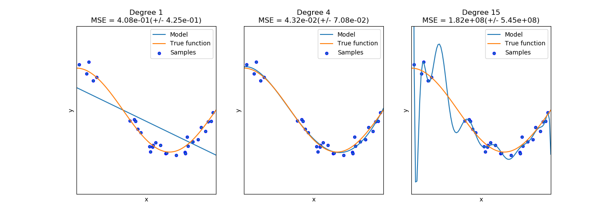

# Project: Follow me
### Vincent FORTINEAU, R&D Engineer at ALPhANOV, Bordeaux, France

#### Project due : 17th July 2018
---

## Goals and steps of the project

1. Download the training dataset from above and extract to the project `data` directory.
2. Implement your solution in model_training.ipynb
3. Train the network locally, or on [AWS](https://classroom.udacity.com/nanodegrees/nd209/parts/09664d24-bdec-4e64-897a-d0f55e177f09/modules/cac27683-d5f4-40b4-82ce-d708de8f5373/lessons/197a058e-44f6-47df-8229-0ce633e0a2d0/concepts/27c73209-5d7b-4284-8315-c0e07a7cd87f?contentVersion=1.0.0&contentLocale=en-us).
4. Continue to experiment with the training data and network until you attain the score you desire.
5. Once you are comfortable with performance on the training dataset, see how it performs in live simulation!
6. Run QuadSim
7. Click the `DL Training` button
8. Set patrol points, path points, and spawn points. **TODO** add link to data collection doc
9. With the simulator running, press "r" to begin recording.
10. In the file selection menu navigate to the `data/raw_sim_data/train/run1` directory
11. **optional** to speed up data collection, press "9" (1-9 will slow down collection speed)
12. When you have finished collecting data, hit "r" to stop recording.
13. To reset the simulator, hit "`<esc>`"
14. To collect multiple runs create directories `data/raw_sim_data/train/run2`, `data/raw_sim_data/train/run3` and repeat the above steps.
15. Copy your saved model to the weights directory `data/weights`.
16. Launch the simulator, select "Spawn People", and then click the "Follow Me" button.
17. Run the realtime follower script `$ python follower.py my_amazing_model.h5`


[//]: # (Image References)

#### [Evaluation criteria](https://review.udacity.com/#!/rubrics/1155/view) 

## Table of Contents

* [Environment](#part0)
	* [1. Libraries](#0-1)
	* [2. Supporting functions](#0-2)
* [Fully Convolutional Network](#part1)
	* [1. Convolutional Neural Network](#1-1)
		* [a. Convolution](#1-1-a)
		* [b. Rectified Linear Unit (ReLU)](#1-1-b)
		* [c. Max Pooling](#1-1-c)
		* [d. Softmax Activation](#1-1-d)
	* [2. Deconvolutional Layers](#1-2)
	* [3. FCN architecture](#1-3)
		* [a. Encoder](#1-3-a)
		* [b. Decoder](#1-3-b)
		* [c. Model](#1-3-c) 
* [Hyper parameters] (#part2)
	* [1. Learning rate](#2-1)
	* [2. Batch size](#2-2)
	* [3. Epochs](#2-3)
	* [4. Workers](#2-4)
	* [5. Test](#2-5)
* [Scoring and simulation] (#part3)
	* [1. Scores](#3-1)
	* [2. Simulation](#3-2)


### Environment <a name="part0"></a>

_In this project, we will train a deep neural network to identify and track a target in simulation. So-called “follow me” applications like this are key to many fields of robotics and the very same techniques you apply here could be extended to scenarios like advanced cruise control in autonomous vehicles or human-robot collaboration in industry._

[image_0]: ./misc/sim_screenshot.png
![alt text][image_0] 

#### 1. Libraries <a name="0-1"></a>

```python
import os
import glob
import sys
import tensorflow as tf

from scipy import misc
import numpy as np

from tensorflow.contrib.keras.python import keras
from tensorflow.contrib.keras.python.keras import layers, models

from tensorflow import image

from utils import scoring_utils
from utils.separable_conv2d import SeparableConv2DKeras, BilinearUpSampling2D
from utils import data_iterator
from utils import plotting_tools 
from utils import model_tools
```

* **tensorflow** 1.2.1 machine learning functions
* **numPy** 1.11 mathematic functions
* **sciPy** 0.17.0 advanced scientific functions
* **keras** deep neural network functions

#### 2. Supporting functions <a name="0-2"></a>

**Separable Convolutions**

Separable convolution layers helps reducing the number of parameters while keeping efficiency.

```python
def separable_conv2d_batchnorm(input_layer, filters, strides=1):
    output_layer = SeparableConv2DKeras(filters=filters,kernel_size=3, strides=strides,
                             padding='same', activation='relu')(input_layer)
    
    output_layer = layers.BatchNormalization()(output_layer) 
    return output_layer

def conv2d_batchnorm(input_layer, filters, kernel_size=3, strides=1):
    output_layer = layers.Conv2D(filters=filters, kernel_size=kernel_size, strides=strides, 
                      padding='same', activation='relu')(input_layer)
    
    output_layer = layers.BatchNormalization()(output_layer) 
    return output_layer

```

**Bilinear Upsampling**

```python
def bilinear_upsample(input_layer):
    output_layer = BilinearUpSampling2D((2,2))(input_layer)
    return output_layer
```

### Fully Convolutional Network <a name="part1"></a>

_A Fully Convolutional Network (FCN) is the combination of a Convolutional Neural Network and Deconvolutional Layers. It allows segmentic classification._


#### 1. Convolutional Neural Network <a name="1-1"></a>

A [Convolutional Neural Network](https://en.wikipedia.org/wiki/Convolutional_neural_network) (CNN) is a learning process bio-inspired by the animal visual cortex neuron organization. It tries to found a **complex non linear function** that helps regrouping data, according to **undifined features** - _it can therefore be compared with a black box_. Neurons are stated with weights and bias that help to define the function. 

<center>


<sub>(C) _CS231n Convolutional Neural Networks for Visual Recognition_</sub>

</center>

It uses 4 main operations :

* Convolution
* ReLU (non linearity)
* Max Pooling (or downsampling)
* Softmax Activation

<center>


<sub>(C) _Aphex34, 2015 CC_</sub>

</center>


##### a. Convolution <a name="1-1-a"></a>

The goal of this operation is to try to extract features from an input image, while preserving the **spatial connections** between pixels.

The convolution is an operation that uses a kernel, a 2D matrix with given dimensions, that is going to slide through an image - which is also a matrix. At every position of the kernel, an element wise multiplication is done between both matrices, and those outputs are summed, giving a value. So for every kernel position, we get a value.

<center>


<sub>(C) _An Intuitive Explanation of Convolutional Neural Networks, by **ujjwalkarn**_</sub>

</center>

The **kernel** are a major factor of the operation, the feature map - result of the convolution - can be blurred or can give edge detection according to the kernel. In the case of visual recognition, kernels are analog to the weights of the neuronal network.

Other notable parameters are the **stride** and the **padding**. The first one defines how many pixel are between each operation while the padding - often zero-padding - consists in filling the border of the picture with values, so that the feature map will be the same size as the input picture.

**1x1 Convolution** 

This is a peculiar case of convolution, indeed, this one saves the spatial details, since the dimensions before and after the operation remain the same. Therefore, one of the reason it is used is that it helps **reducing the number of filters** - _parameters_. It also adds more non-linearity by having ReLU immediately after, and makes the architectures **deeper** (_without increasing the number of parameters_).

It can therefore be used after any other convolution like in inception architecture - _see Figure below_ -, or at the level of the fully connected layers.

<center>


<sub>(C) _Inception Module, by Aaditya Prakash, 2016_</sub>

</center>


##### b. Retified Linear Unit (ReLU) <a name="1-1-b"></a>

The ReLU is probably the most basic **non-linear** operation, it is linear for the positive values and equal to zero for the negative values. It can be obtained with the following snippet :

```python
def ReLU(inp):
    out = []
    for a in inp:
        out.append(max(0, a))
    return out
```

This function introduces non linearity in the neural network, and allows the detection of more complex patterns.

##### c. Max Pooling <a name="1-1-c"></a>

This steps, also called downsampling, reduces the dimensions of the feature maps, while retaining the most relevant data. This makes the input **smaller** - easier to deal with -, it also makes the networks more **robust** - resistant to small changes - and **reduces** the number of **parameters** - which helps against overfitting.

Both kernel dimensions and strides are defined as shown is the picture below, and only the biggest element element selected by the kernel on the feature map, is kept. 

<center>


<sub>(C) _CS231n Convolutional Neural Networks for Visual Recognition_</sub>

</center>

Other operation might be used instead of the max pooling, for example sum or mean. 

This is a different solution than just using a stride value superior to 1 during the convolution step - which reduces more randomly the parameters.

##### d. Softmax Activation <a name="1-1-c"></a>

The softmax activation function helps **classifying** the features in the input image with a fully connected layer.

The function returns a **class normalized** output which gives the probabilistic interpretation for each class. The sum of the probabilities is always 1, and each class score is comprised between 0 and 1. This function also allows dealing with negative score, thanks to the exponential function.

The main difference between softmax function and [sigmoid](https://en.wikipedia.org/wiki/Sigmoid_function) function lies in their goal. The first one helps for multi-classification tasks whereas the other one for binary classification tasks.

```python
def softmax(x):
	sum_exp = np.sum(np.exp(x))
	return np.exp(x)/sum_exp
```

<center>


<sub>(C) _Vincent F., CC_</sub>

</center>

This function is found at the end of the CNN, after a [fully connected layer](https://leonardoaraujosantos.gitbooks.io/artificial-inteligence/content/fc_layer.html).


#### 2. Deconvolutional Layers <a name="1-2"></a>

For what we have seen now, CNN output the probability of something, but it loses any spatial information throught its layers. In fact, the more layers, the more features are extracted, but the less spatial data is kept. This phase is often called **feed-forward propagation** or inference.

The deconvolution is the process of retrieving the spatial details, while keeping what has been earned in the CNN, so that every pixel can be classified with some meaning -pixelwise prediction. This is the **backward propagation**.

<center>


<sub>(C) _Example of a FCN with 10 layers, by [ternaus](https://github.com/ternaus/TernausNetV2)_</sub>

</center>

The process lies on upsampling and concatenation - _skip connections_ - of encoder layers with decoder layers.

What makes Deep-learning algorithms - _like FCN_ - so powerful, compared to usual machine learning algorithms is that they extract relevant features on their own. There is no need to teach the algorithm how to recognize a cat, or a car, what is required is a large quantity of data already classified and normalized for the training.

However, the more complicated the task, the deeper needs to be the architecture of the machine learning algorithm, and the more data is required for the training.

**Comment**: it is important to notice that for this kind of deep learning algorithm, the size of the input pictures really matters. The dimension of the feature maps at every layers must be watch with perculiar care.

#### 3. FCN Architecture <a name="1-3"></a>

For our case study, 3 encoders layers and 3 decoders layers will be used to facilitate the learning phase. Indeed, the more layers, the harder it is to train the FCN, since it increase the number of parameters.

The downsampling and upsampling are connected together throught a fully connected layer using 1x1 convolution, batch normalization and ReLU.

##### a. Encoder <a name="1-3-a"></a>

```python
def encoder_block(input_layer, filters, strides):
    
    output_layer = separable_conv2d_batchnorm(input_layer, filters, strides)
        
    return output_layer
```

This encoder layer contains a convolution with a 3x3 kernel, and a stride value of 2 (for downsampling), and a ReLU activation. 

An alternative to a stride of 2 would have been to use pooling - _max pooling for example, as decribed above_ - this might improve the efficiency of the architecture. In fact, choosing max pooling instead of a 2x2 stride is a process allowing the extration of more relevant data, and is less random. 

<center>


<sub>(C) _Encoder block, Vincent F. 2018_</sub>

</center>

At every enconding layer, the downsampling provokes loss of spatial information. This is why we then use a decoder, to try to retrieve this loss.

##### b. Decoder <a name="1-3-b"></a>

```python
def decoder_block(small_ip_layer, large_ip_layer, filters):
    
    up_sampled = bilinear_upsample(small_ip_layer)
    
    concatenated = layers.concatenate([up_sampled, large_ip_layer])
    
    output_layer = separable_conv2d_batchnorm(concatenated, filters, strides=1)
    
    return output_layer
```

This decoder layer contains a concatenation - _skip connection_ -, a 2x2 upsampling, and a convolution with a 3x3 kernel, and a stride value of 2 (for downsampling), and a ReLU activation. 

<center>


<sub>(C) _Encoder block, Vincent F. 2018_</sub>

</center>

To retrieve the spatial details, a previous layer is interpolated with the upsampled output throught **skip connections**.


##### c. Model <a name="1-3-c"></a>

```python
def fcn_model(inputs, num_classes):
    
    print("Input  shape:",inputs.shape, "  \tImage input")
     
    # With each encoder layer, the depth of the model increases.
    layer_1 = encoder_block(inputs, 32, 2)
    print("layer_1  shape:",layer_1.shape, "  \tEncoder Layer 1")
    
    layer_2 = encoder_block(layer_1, 64, 2)
    print("layer_2  shape:",layer_2.shape, "  \tEncoder Layer 2")
    
    layer_3 = encoder_block(layer_2, 128, 2)
    print("layer_3  shape:",layer_3.shape, "  \tEncoder Layer 3")


    conv_1x1 = conv2d_batchnorm(layer_3, 64, kernel_size=1, strides=1)
    print("conv_1x1  shape:",conv_1x1.shape, "  \t1x1 Convolutional Layer")
    
    
    layer_3dec = decoder_block(conv_1x1, layer_2, 128)
    print("layer_3dec  shape:",layer_3dec.shape, "  \tDecoder Layer 3")
    
    layer_2dec = decoder_block(layer_3dec, layer_1, 64)
    print("layer_2dec  shape:",layer_2dec.shape, "  \tDecoder Layer 2")
    
    layer_1dec = decoder_block(layer_2dec, inputs, 32)
    print("layer_1dec  shape:",layer_1dec.shape, "  \tDecoder Layer 1")
    
    x = layer_1dec
    
    output = layers.Conv2D(num_classes, 1, activation='softmax', padding='same')(x)
    print("output  shape:",output.shape, "  \tOutput Image")
    
    return output
```

<center>


<sub>(C) _FCN architecture, Vincent F. 2018_</sub>

</center>


```python
Inputs  shape: (?, 160, 160, 3)      Input Image
layer_1  shape: (?, 80, 80, 32)      Encoder Layer 1
layer_2  shape: (?, 40, 40, 64)      Encoder Layer 2
layer_3  shape: (?, 20, 20, 128)     Encoder Layer 3
conv_1x1  shape: (?, 20, 20, 128)    1x1 Convolutional Layer
layer_3dec  shape: (?, 40, 40, 128)  Decoder Layer 3
layer_2dec  shape: (?, 80, 80, 64)   Decoder Layer 2
layer_1dec  shape: (?, 160, 160, 32) Decoder Layer 1
output  shape: (?, 160, 160, 3)      Output Image
```

As explained in [2. Deconvolutional Layers](#1-2), the same architecture could be used to detect cats or dogs, but it would require a different dataset or at least - _if the data already has cats and dogs_ - different masks. Then, the model would need to be trained again. 

### Hyper parameters and training <a name="part2"></a>

To speed up my simulation, my employer allowed me to use a server to train the deep learning algorithm. So while my personal laptop had the following characteristics :

**OSX 10.11.6**

* 12 Gio Memory
* 2,5 GHz Intel Core i5
* Intel HD Graphics 4000 1536 Mo

I could take advantage of thoses :

**Ubuntu 16.04 LTS**

* 881,3 Gio Memory
* Intel Xeon(R) Silver 4114 CPU @ 2.2GHz x 40
* GeForce GTX 1050 Ti/PCle/SSE2

**Data set**

I only used the provided data set with the following details:

<center>

| Data set      | Nb of pictures  |
|:--------------|:----:|
|  Training set | 4131 |
|Validation set | 1184 |

</center>

#### 1. Learning rate <a name="2-1"></a>

The learning rate parameter is crucial. If we choose it too high the results might never converge and the training will fail, but on the other side, if we choose it too low, it will take too much time to train.

I will try the following values 0.0005, 0.005, 0.05 and 0,5.

This is relevant to notice that the stochastic optimization algorithm used here is an extension of the gradiant descent called Adam.

#### 2. Batch size <a name="2-2"></a>

The batch size defines how the dataset is going to be divided into several smaller parts. This factor allow computer with relatively small memory size to deals with important set of data.

For example with my personnal computer I used batch size of 20 to 30 while with the server I chose a batch size of 200 to 1000.

#### 3. Epochs <a name="2-3"></a>

The epoch is when the entire dataset is passed forward and backward through the neural network. Since we use a stochastic algorithm, we need more than one iteration to better fit the data. Indeed, having a small number of epoch might result in an underfitting model, but on the other hand, having a number of epoch that is too high might result in an overfitting model. 

<center>



<sub>(C) _Example of underfitting (left) and overfitting (right), by scikit-learn developers BSD_</sub>

</center>

The **steps per epoch** often called number of iteration, is the number of batches needed to complete one epoch. Knowing our dataset, and the batch size, we can deduce it easily :

```python
NB_DATA = 4131
steps_per_epoch = np.ceil(NB_DATA/batch_size)
NB_VALID_DATA = 1184
validation_steps = np.ceil(NB_VALID_DATA/batch_size)
```

#### 4. Workers <a name="2-4"></a>

On my personal computer, the number of worker is limited to 4, since I only have 4 cores, while on the server I can use up to 40 workers.

#### 5. Tests <a name="2-5"></a>

**Laptop tests**

<table><tbody>

    <tr><th align="center">Parameters</th><th align="center">Values</th><td align="center" rowspan="10">
    
    </td></tr>
    <tr><td align="left">Learning rate</td>   <td align="center">0.05</td></tr>
    
    <tr><td align="left">Batch size</td>      <td align="center">50</td></tr>
    
    <tr><td align="left">Nb epochs</td>      <td align="center">30</td></tr>
    
    <tr><td align="left">Workers</td>         <td align="center">4</td></tr>
    
    <tr><th align="center">Scores</th><th align="center">Values</th>

    <tr><td align="left">Train loss</td>      <td align="center">0.020</td></tr>
    
    <tr><td align="left">Validat. loss</td>        <td align="center">0.046</td></tr>
    
    <tr><td align="left">Final score</td>     <td align="center">0.412</td></tr>
    
<tr><td align="left">Training durat.</td>     <td align="center">16h47</td></tr>
    
</tbody></table>


<table><tbody>

    <tr><th align="center">Parameters</th><th align="center">Values</th><td align="center" rowspan="10">
    
    </td></tr>
    <tr><td align="left">Learning rate</td>   <td align="center">0.01</td></tr>
    
    <tr><td align="left">Batch size</td>      <td align="center">20</td></tr>
    
    <tr><td align="left">Nb epochs</td>      <td align="center">30</td></tr>
    
    <tr><td align="left">Workers</td>         <td align="center">4</td></tr>
    
    <tr><th align="center">Scores</th><th align="center">Values</th>

    <tr><td align="left">Train loss</td>      <td align="center">0.0113 </td></tr>
    
    <tr><td align="left">Validat. loss</td>        <td align="center">0.0206</td></tr>
    
    <tr><td align="left">Final score</td>     <td align="center">0.410</td></tr>
    
<tr><td align="left">Training durat.</td>     <td align="center">12h07</td></tr>
    
</tbody></table>

**Server tests**

<table><tbody>

    <tr><th align="center">Parameters</th><th align="center">Values</th><td align="center" rowspan="10">
    
    </td></tr>
    <tr><td align="left">Learning rate</td>   <td align="center">0.0005</td></tr>
    
    <tr><td align="left">Batch size</td>      <td align="center">1000</td></tr>
    
    <tr><td align="left">Nb epochs</td>      <td align="center">100</td></tr>
    
    <tr><td align="left">Workers</td>         <td align="center">40</td></tr>
    
    <tr><th align="center">Scores</th><th align="center">Values</th>

    <tr><td align="left">Train. loss</td>      <td align="center">0.0256</td></tr>
    
    <tr><td align="left">Validat. loss</td>        <td align="center">0.0374</td></tr>
    
    <tr><td align="left">Final score</td>     <td align="center">0.295</td></tr>
    
<tr><td align="left">Training durat.</td>     <td align="center">19h34</td></tr>
    
</tbody></table>

<table><tbody>

    <tr><th align="center">Parameters</th><th align="center">Values</th><td align="center" rowspan="10">
    
    </td></tr>
    <tr><td align="left">Learning rate</td>   <td align="center">0.005</td></tr>
    
    <tr><td align="left">Batch size</td>      <td align="center">1000</td></tr>
    
    <tr><td align="left">Nb epochs</td>      <td align="center">80</td></tr>
    
    <tr><td align="left">Workers</td>         <td align="center">40</td></tr>
    
    <tr><th align="center">Scores</th><th align="center">Values</th>

    <tr><td align="left">Train. loss</td>      <td align="center">0.0278</td></tr>
    
    <tr><td align="left">Validat. loss</td>        <td align="center">0.0401</td></tr>
    
    <tr><td align="left">Final score</td>     <td align="center">0.243</td></tr>
    
<tr><td align="left">Training durat.</td>     <td align="center">15h50</td></tr>
    
</tbody></table>

<table><tbody>

    <tr><th align="center">Parameters</th><th align="center">Values</th><td align="center" rowspan="10">
    
    </td></tr>
    <tr><td align="left">Learning rate</td>   <td align="center">0.005</td></tr>
    
    <tr><td align="left">Batch size</td>      <td align="center">200</td></tr>
    
    <tr><td align="left">Nb epochs</td>      <td align="center">50</td></tr>
    
    <tr><td align="left">Workers</td>         <td align="center">40</td></tr>
    
    <tr><th align="center">Scores</th><th align="center">Values</th>

    <tr><td align="left">Train. loss</td>      <td align="center">0.0200</td></tr>
    
    <tr><td align="left">Validat. loss</td>        <td align="center">0.0281</td></tr>
    
    <tr><td align="left">Final score</td>     <td align="center">0.347</td></tr>
    
<tr><td align="left">Training durat.</td>     <td align="center">8h30</td></tr>
    
</tbody></table>

<table><tbody>

    <tr><th align="center">Parameters</th><th align="center">Values</th><td align="center" rowspan="10">
    
    </td></tr>
    <tr><td align="left">Learning rate</td>   <td align="center">0.001</td></tr>
    
    <tr><td align="left">Batch size</td>      <td align="center">200</td></tr>
    
    <tr><td align="left">Nb epochs</td>      <td align="center">80</td></tr>
    
    <tr><td align="left">Workers</td>         <td align="center">40</td></tr>
    
    <tr><th align="center">Scores</th><th align="center">Values</th>

    <tr><td align="left">Train. loss</td>      <td align="center">0.0129</td></tr>
    
    <tr><td align="left">Validat. loss</td>        <td align="center">0.0382</td></tr>
    
    <tr><td align="left">Final score</td>     <td align="center">0.369</td></tr>
    
<tr><td align="left">Training durat.</td>     <td align="center">13h39</td></tr>
    
</tbody></table>

### Scoring and Simulation <a name="part3"></a>

#### 1. Scores <a name="3-1"></a>

To score the network on the Follow Me task, two types of error are measured. First the intersection over the union for the pixelwise classifications is computed for the target channel. 

In addition to this we determine whether the network detected the target person or not. If more than 3 pixels have probability greater then 0.5 of being the target person then this counts as the network guessing the target is in the image. 

We determine whether the target is actually in the image by whether there are more than 3 pixels containing the target in the label mask. 

Using the above the number of detection true_positives, false positives, false negatives are counted. 

**How the Final score is Calculated**

The final score is computed as follow - pixelwise: 

```python
average_IoU * (n_true_positive / (n_true_positive + n_false_positive + n_false_negative))

``` 

The best score was obtained with of learning rate of 0.05 on my personal computer, therefore, it is this model that is going to be used.
 
| Original picture | Ground truth | Result |
|:--:              |:--:          |:--:    |
|  |  |  |
|  |  |  |


#### 2. Simulation <a name="3-2"></a>


**Ideas for Improving the Score**

Collecting more data from the sim and adding somes layers to the architecture can be a solution to improve the training.
