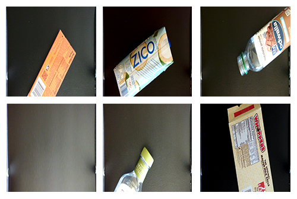
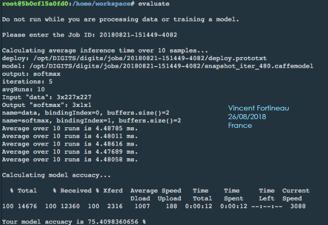
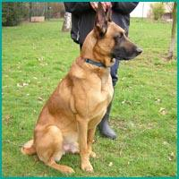
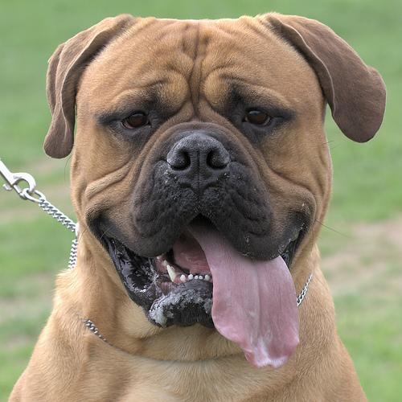

# Project: Robotic Inference
### Vincent FORTINEAU, R&D Engineer, Paris, France

#### Project due : 22nd August 2018
---

## Goals and steps of the project

* Using the supplied data in the digits image, create a network that achieves at least 75 percent accuracy and an inference time of less than 10 ms. This can be done by running the evaluate command. 
* Determine what you want your robotic inference idea to be. Collect your own data that fits with what your model is trying to accomplish. Train a network that produces meaningful results.
* Document the project following the provided structure. Be sure to include and talk about both networks you worked on.

[//]: # (Image References)

#### [Evaluation criteria](https://review.udacity.com/#!/rubrics/1319/view) 

## Table of Contents

* [Udacity dataset](#part1)
	* [1. Background](#1-1)
	* [2. Results](#1-2)

* [Standford Dogs dataset](#part2)
	* [1. Introduction](#2-1)
	* [2. Background](#2-2)
	* [3. Data Acquisition](#2-3)
	* [4. Results](#2-4)
	* [5. Discussion](#2-5)

* [Conclusion](#part3)

## Udacity dataset 

### 1. Background 

The images provided are pictures of candy boxes, bottles and empty conveyour belt for real time sorting.

The photos are in an ** 8bit color depth**, and **500x500 px** dimensions.

  

(C) Udacity 

The Nvidia Digits workspace provides 3 deep neural architectures, **LeNet**, **AlexNet** and **GoogLeNet** for image classification.

Because of the dimensions, the LeNet is less efficient than the other two. Indeed, it expects grey scaled data in a 28x28 format, whereas the other architectures are designed for colored data at greater dimensions: 256x256 which will less compress the images.

To reach good results, a starting **learning rate of 0.001** was set with **15 epoches**.

For the AlexNet architecture, the validation accuracy reaches more than 99,9% after 6 epoches. The validation loss are slightly above 0.006% at the end.

For the GoogLeNet architecure, the validation accuracy reaches more than 99,9% after the first epoch. The validation loss are slightly above 0.00002% at the end.

So we can see than the GoogLeNet architecture is more efficient, which confirm what was discussed in the class about the accuracy per operation. Moreover, this design has a better accuracy. It is therefore this one that will be used.

### 2. Results 

For the AlexNet architecture the accuracy was 75.4098360656 % with an inference time of 5.3 ms. 

I obtained the exact same accuracy for GoogLeNet, which makes me wonder about the evaluate function.

Evaluate function result, Vincent F.

## Standford Dogs dataset 

### 1. Instroduction 

The identification of species, breeds and their classification has always been a complex subject for biologist, and still is.

Live camera, or remote camera are used to observe wild life in its environemment. It is relevant to try to locate endangered species, and doing it automatly with camera would save a lot of time, for researcher.

In this case, the accuracy is probably more important than the inference time.

The lack of previous photographs would lead in the incapacity to use deep neural network, for this issue it might be interesting to try to identify more general type/class of animal first. 

### 3. Data Acquisition 

I used a pre-existing dataset of dogs pictures to try to demonstrate the possibility of identifying breeds of dogs, the [Standford Dogs Dataset](http://vision.stanford.edu/aditya86/ImageNetDogs/).

The difficulty with this data set is that the photgraphs are provided with unconsistant dimension. The dogs are divided into 120 breeds, with 150 to 300 images per breed.

The amount of data was not sufficient for a single breed, so I decided to regroup the data according the **Fédération Cynologique Internationale** (World Canine Organization) grouping system. The groups are based on appearance and use of the dogs.

I chose the group 1 section 1, **Sheepdogs** and the goup 2 section 2 **Molossoid**.

On the left **malinois sheperd** from group 1, on the right **bull mastiff** from group 2

Using this group allow me to have 1394 pictures for the first group and 1538 for the second one, which is a good start.

In order to adpat the input pictures dimension, I tried different options and kept the one providing the best results, _cropping_ (the other possibilities being fill, both crop and fill and squash). _I tried training the model with combination option, but the results were not improved._

### 4. Results 

The accuracy of the model on the validation set was 70,79%, which is still a little low, but quite encouraging, since the 2 groups considered are for some breeds similar. In fact, the grouping can for some breeds be quite arbitrary since it can be defined by the "use" of the dog, and not only rely on appearances.

### 5. Discussion 

Reaching an accuracy of 70,79% on the validation set does not mean having a 70,79% accuracy overall, but it is an encouraging result. Indeed, we are trying to train an algorithm to split 2 types of dogs that are quite alike. It could be easier to classify different species.

It is to be considered that for remote camera, many animal will only be observed at night time, so only greyscale pictures could be used. Moreover, the animal will unlikely be facing the camera, so this might complexify the identification (even for a human being).

## Conclusion 

The different results obtained with the provided dataset and the Standford Dogs dataset also show how important the data is. The quality, the sorting, and the preparation of the dataset are very important for deep neural network.

It is also important to consider biais that might result in damaging drop of the efficiency of the DNN, in real use.

It could be quite interesting to study how a DNN would classify species only according to their appearance.

It is common knowledge today that species cannot be classified only based on their appearances, biologocial informations (DNA, etc.) could also be used with DNN probably with more efficiency than images.