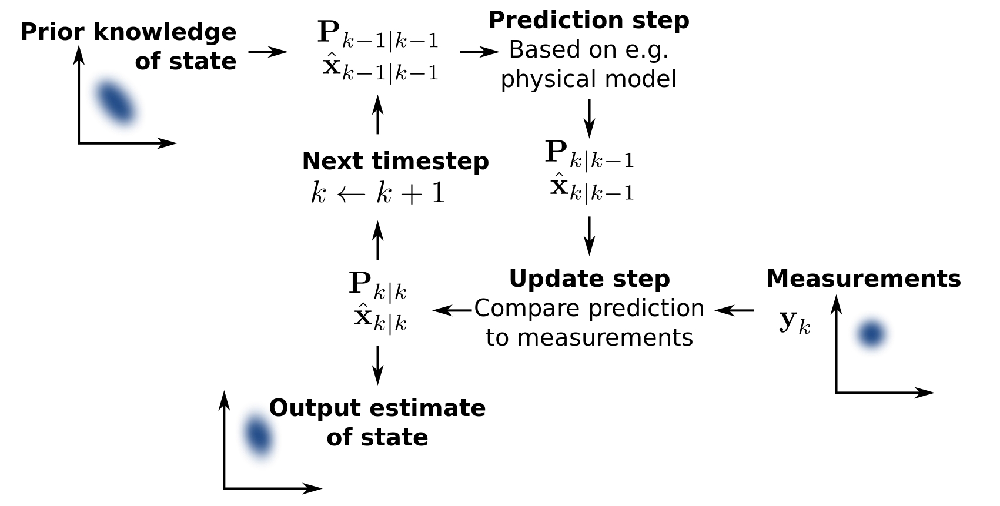

# Project: Where am I ?
### Vincent FORTINEAU, R&D Engineer, Paris, France

#### Project due : 12nd September 2018
---


## Goals and steps of the project

* Create your own ROS package, develop a mobile robot model for Gazebo, and integrate the AMCL and Navigation ROS packages for localizing the robot in the provided map.
* Using the Parameter Tuning section as the basis, add and tune parameters for your ROS packages to improve your localization results in the map provided. 
* After achieving the desired results for the robot model introduced in the lesson, implement your own robot model with significant changes to the robot's base and possibly sensor locations.
* Check your previous parameter settings with your new robot model, and improve upon your localization results as required for this new robot.


[//]: # (Image References)


#### [Evaluation criteria](https://review.udacity.com/#!/rubrics/1365/view) 

<center> 

**Abstract** 

</center>

_This report presents 2 simple robots created in a simulated environment. An **Adaptative Monte Carlo Localization** (AMCL) algorithm was implemented in those robot using **ROS** packages to help them navigate in a maze like map. The parameters and configurations of the AMCL package are studied here._ 

## Table of Contents

* [Mobile Robot](#part1)
	* [1. Introduction](#1-1)
	* [2. Background](#1-2)
		* [a. Kalman Filter](#1-2-a)
		* [b. Particle Filter](#1-2-b) 
	* [3. Model Configuration](#1-3)
	* [4. Results](#1-4)
	* [5. Discussion](#1-5)

* [Conclusion](#part3)

## Mobile Robot <a name="part1"></a>

### 1. Introduction <a name="1-1"></a>

As said in this class, robots are defined by three actions :

* **Sensing** the environnment (_sensors_)
* **Computing** and making decision (_processors_)
* **Acting** and interracting with the environnment (_actuators_)

For a mobile robot, the goal is often to go from a place to an other location. To reach this purpose, the robot need to know its **pose** (position and orientation), before beeing able to move in the right direction.

Sensors helps the robot to determine its location, we can talk about [GPS sensors](https://en.wikipedia.org/wiki/Global_Positioning_System), that give a position on earth (thanks to satellites), [inertial measurment unit](https://en.wikipedia.org/wiki/Inertial_measurement_unit) that give information about the orientation and angular speed, [LIDAR](https://en.wikipedia.org/wiki/Lidar) that helps getting distance from objects (landmarks...), camera and more. 

Most of this sensors cannot give directly the position of the robot in its environnement. GPS has a precision within a meter, and is not available inside buildings, so it does not provide sufficient information. 

Some sensors are very useful but require a **known environmment**, to be used for localization. 

<center> 

<sub>(C) Laïka, mobile robot for dogs entertainment,  developped by Camtoy </sub></center>

### 2. Background <a name="1-2"></a>

The localization problem might seem quite simple, at first sight. However, knowing that sensors are inaccurate and noisy and that actuators can be faulty and imprecise it becomes more of a challenge to reach good estimation of a robot pose.

In this report, we will use an method based on the **Monte Carlo** algorithm also know as **particle filter**. We will briefly presents the **Kalman filter** method that is an other know solution to the localization problem. 

Even though we will not dicuss them, it is relevant to cite [Markov](https://www.ri.cmu.edu/pub_files/pub1/fox_dieter_1999_3/fox_dieter_1999_3.pdf) and [Grid](https://books.google.fr/books?id=2Zn6AQAAQBAJ&pg=PA238&lpg=PA238&dq=grid+localization+histogram+filter&source=bl&ots=vIhBUDCGTA&sig=i7PxEo80buCrXHaXMTcXbQnNLJQ&hl=fr&sa=X&ved=2ahUKEwiWhc2rsbPdAhVEzYUKHe_ZDx04FBDoATABegQICRAB#v=onepage&q=grid%20localization%20histogram%20filter&f=false) Localization methods.

#### a. Kalman Filter <a name="1-2-a"></a>

This method estimates the state of a dynamic system with noisy and incomplete data. It works with 2 phasis, the **prediction** and the **update**. The prediction phase uses the previous estimated state to produce a first guess of the current position, then the update phase correct this prediction using observation of the current state.

<center> 

<sub> Basic concept of Kalman filtering by Petteri Aimonen, 2011 (CC)  </sub></center>


It is relevant to notice that the [Kalman filter](https://en.wikipedia.org/wiki/Kalman_filter) makes the assumption that motion is linear and that the state of the system can be represented with a unimodal Gaussian distribution.

To overcome those limitation, the Extended Kalman Filter (EKF) works with differential fonctions, a Jacobian matrix to linearize the function near the current estimation. This solution uses more complex mathematics and requires more computational time and CPU.

#### b. Particle Filter <a name="1-2-b"></a>

Also know as the [Monte Carlo](https://en.wikipedia.org/wiki/Particle_filter) (MCL) method in reference to the casino, this algorithm distributes weighted particles and adjuts the weights according to the probability of each particle. The least likely particules are remplaced by more probable ones.

The probability density, called belief, is estimated using recursive [Bayes filtering](https://en.wikipedia.org/wiki/Recursive_Bayesian_estimation).

The algorithm has five steps :

* Previous Belief
* Motion Update
* Measurement Update
* Resampling
* New Belief

<center> 
</center>

Particle filters provide a good alternative to Kalman filters, with a sufficient number of samples, this approch reach the optimal Bayesian estimate with more robustness.

<center>

|               |      MCL        |      EKF      |
|:------------- |:---------------:| :------------:|
| Measurements  | Raw             |  Landmarks    |
|Measurements noise| Any          |      Gaussian |
| Posterior     | Particle s      |      Gaussian |
| Memory Efficiency|   +          |  ++           |
| Time efficiency| +              | ++            |
| Implementation| ++              | +             | 
| Resolution    | +               |  ++           |
| Robustness    | ++              | /             | 
| Mem.&res. ctrl| yes             | no            |
| Global localization| yes        | no            |
| State space   | multimodal discrete | unimodal continuous |

</center>

An adaptative particle localization method was used with ROS package. AMCL ROS package provides a dynamic algorithm that adpats the number of particles over time. This model combines **laser** data and **odometery** data.

### 3. Model Configuration <a name="1-3"></a>

<center> 

<sub> Tf overview, Robot Setup ROS (CC) </sub></center>


As described in the ROS documentation for [AMCL](http://wiki.ros.org/amcl#Parameters):

"_AMCL is a probabilistic localization system for a robot moving in 2D. It implements the adaptive (or KLD-sampling) Monte Carlo localization approach (as described by Dieter Fox), which uses a particle filter to track the pose of a robot against a known map._"

For a proper behaviour of the amcl package, several parameters can/must be tuned about the overall filter, the laser model and the odometery model. 

The computational limitation of the CPU forces some parameters down, for example the maximum number of particles is by default set to 5000, and was reduced to 250, with a minimum number of particles set to 10.

It was also advised to modify some odometery parameters, called alphas, according to the model used. In our case, the model considered is the **corrected differential model**, that is defined as a "new model" in the documentation. It is said that "_the default settings of the **odom\_alpha** parameters only fit the old models, for the new model these values probably need to be a lot smaller_".

The values suggested for the 4 alpha parameters are provided in the following table according to this discussion "_[Tuning AMCL's diff-corrected and omni-corrected odom models](https://answers.ros.org/question/227811/tuning-amcls-diff-corrected-and-omni-corrected-odom-models/)_":

<center>

| parameter     | value   |
|---------------|---------|
| odom_alpha1   |  0.005  |
| odom_alpha2   |  0.005  |
| odom_alpha3   |  0.010  |
| odom_alpha4   |  0.005  |

</center>

Other configurations need to be chosen for the base local planner, documentation can be found on the [TrajectoryPlannerROS](http://wiki.ros.org/base_local_planner). The robot configuration, goal tolerance, forward simulation, trajectory scoring, oscillation prevention, and global plan can be tuned in this section.


```xml
TrajectoryPlannerROS:

  holonomic_robot: false
  max_vel_x: 0.45
  min_vel_x: 0.1
  max_vel_theta: 1.0
  min_in_place_vel_theta: 0.4

  acc_lim_theta: 3.2
  acc_lim_x: 2.5
  acc_lim_y: 2.5

  meter_scoring: yes

  pdist_scale: 0.5

  #sim_time: 5.0 # this value depends on the CPU

  controller_frequency: 10

```

The controller frequency had to be limited to 10Hz because of CPU limitation.

**pdist_scale** give the weighting for how much the controller should stay close to the path it was given, the default value was reduced a little.

To avoid the following warning, the meter scoring was set to yes to use the metric system instead of cells (_relevant for pdist\_scale and gdist\_scale parameters_) :

```
[ WARN] [1536595508.057011340, 1527.939000000]: Trajectory Rollout planner initialized with param meter_scoring not set. 
Set it to true to make your settins robust against changes of costmap resolution.

```

Finally the last parameters that need to be dealt with are about the [Costmap](http://wiki.ros.org/costmap_2d) configuration. Most of the configuration here were defined as suggested in [_Common Configuration (local\_costmap) & (global\_costmap)_](http://wiki.ros.org/navigation/Tutorials/RobotSetup).

<center>

| param               | value |
|:-------------------:|:-----:|
| obstacle_range      | 2.5   |
| raytrace_range      | 3.0   |
| transform_tolerance | 0.2   |
| inflation_radius    | 0.40 - 0.15 |

</center>

The only parameter that had to be modified is the **inflation radius**, the robot was having unexpected behaviour with a value around 0.55, and above he was even getting stuck. It was experimentaly determined that with value between 0.40 and 0.15 inflation radius was not blocking the mobile robot (_a value too small could result in blocking scenario_). The inflation radius is highly dependent on the map.

<center>   

<sub> On the left, an inflation radius of 0.4, on the right an inflation radius of 0.15, Vincent F. 2018 (C) </sub></center>


### 4. Results <a name="1-4"></a>

The robot is created using URDF file, and animated in an simulated environment thanks to ROS packages. The simulated environment is provided by Gazebo, while we observe relevant data thanks to RViz.

<center>  

<sub> Udacity bot at its start location, Vincent F. 2018 (C) </sub> </center>

At first, as shown on the image above, the particle cloud is quite spread showing an important uncertainty.

Given all the previous configuration, the amcl algorithm was giving very encouraging results. Within a few seconds the robot is quickly located, and even if the robot is manually moved (_kidnapping problem_) it is able to found its new location. Althought it was not expected, the AMCL algorithm in Gazebo environment dealt really well with the kidnapping problem.

<center>  

<sub> The robot is represented in red, the amcl particles are represented with green arrows, and the laser scan are the red dots that feats the walls, Vincent F. 2018 (C) </sub></center>

Even if it took few minutes to reach the goal with a non optimized trajectory, the robot was able to reach its destination with precision.

<center>  

<sub> Goal reached with sufficient certainty about the robot pose, Vincent F. 2018 (C) </sub></center>

### 5. Discussion <a name="1-5"></a>

The customized robot had a notable different shape, had only one symetry axis. Le laser scanner was mounted on a more elevated position with no significant difference. However, the size of the front wheel had to be taken into consideration to avoid undesired obstruction of the sensor. The robot was completely defined with a URDF file, a great tutorial is available in the [wiki ROS](http://wiki.ros.org/urdf/Tutorials/Building%20a%20Visual%20Robot%20Model%20with%20URDF%20from%20Scratch).

<center>  

<sub> Customized robot shape in Gazebo, Vincent F. 2018 (C) </sub></center>

Considering the configuration, only few things had to be modified, the inflation radius had to be slightly raised, the wheel control had to be modified to take into consideration their new radius. The robot footprint/radius was not defined but it should probably be taken into consideration to avoid possible collisions. 

The performance of the customized robot were a little worse than the first one, probably because of its loss of one symetry, that made it harder to handle. 

<center>  

<sub> Customized robot toward goal, Vincent F. 2018 (C) </sub></center>

## Conclusion <a name="part3"></a>

The project focused on the localization problem, although the navigation was clearly not optimal and too slow to be considered implemented in real time situations.

The next step to focus on, would certainly be about navigation to try to reach position as quickly as possible.

In a controlled environmment with clear path, and flat ground, for example in a plant with defined path for robots, this kind of algorithm would work perfectly. It is important to underline that only one robot was handled at once in those experiments, for industrial purposes, it would be interresting to extend those experiments to several robots.

The use of swarm bot could help localize the robots if they communicate data with each other. In this particular case, the processor could probably be deported to handle a larger amount of data.
