# Project: Map My World ?
### Vincent FORTINEAU, R&D Engineer, Paris, France

#### Project due : 3rd October 2018
---


## Goals and steps of the project

* Download the supplied files here or use `wget https://s3-us-west-1.amazonaws.com/udacity-robotics/Term+2+Resources/P3+Resources/Student+Project+Materials.zip` to bring them into an environment with a terminal.
* Create a ROS package that is able to launch a robot and have it map the surrounding area.
* Use Debug tools and other checks mentioned in the lessons to verify that the robot is mapping correctly.
* Create a 3D map for the supplied environment.
* Create your own Gazebo world and generate a map for that environments as well.


[//]: # (Image References)


#### [Evaluation criteria](https://review.udacity.com/#!/rubrics/1441/view) 

<center>**Abstract**</center>

_This report presents a simulateous localization and mapping (SLAM) ROS package simulated in 2 different Gazebo environments. The RTAB-Map package allows to create a 2D occupancy grid and a 3D octomap, with a robot having few sensors, while moving through an artifical maps. A basic 2 wheeled robot is used to conduct the experiment. _ 

## Table of Contents

* [SLAM](#part1)
	* [1. Introduction](#1-1)
	* [2. Background](#1-2)
		* [a. FastSLAM](#1-2-a)
		* [b. GraphSLAM](#1-2-b) 
	* [3. Simulation Configuration](#1-3)
	* [4. Results](#1-4)
	* [5. Discussion](#1-5)

* [Conclusion](#part3)

## SLAM <a name="part1"></a>

### 1. Introduction <a name="1-1"></a>

As described in the previous report and previous lessons **localization** and **mapping** are 2 very important issues for mobile robots. Previously the map or the pose was known and the other element needed to be defined.

Sadly for autonomous robots, the pose and the map can only be known in very peculiar cases. Most of the time, the map is not known or at least not up to date and sensors might provide noisy and erroneous data. At first sight it seems like the egg and chicken problem, since the map is needed for localization  and the pose is required for mapping.

The SLAM approach gives a way out to both those issues. It is a probabilitic solution that uses Bayes' rule to sequentially solves localization and mapping.

<center>

|Robotic problem   |Probabilitic equation|
|:----------------:|:-------------------:|
| Localization     | P(x<sub>1:t</sub> \| u<sub>1:t</sub>, m, z<sub>1:t</sub>)    |
|  Mapping         | P(m \| z<sub>1:t</sub>, x<sub>1:t</sub>, u<sub>1:t</sub>)    |
|   SLAM           |  P(x<sub>1:t</sub>, m \| z<sub>1:t</sub>, u<sub>1:t</sub>)    |
 
</center>

* x<sub>1:t</sub> : trajectory
* m : map 
* z<sub>1:t</sub> : measurements 
* u<sub>1:t</sub> : controls 

<center> 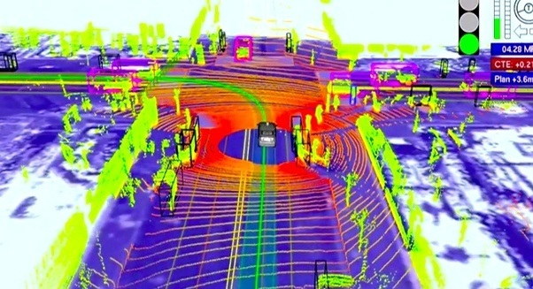

<sub> Map developped by Google's self driving car </sub></center>

The picture above shows a typical case where the SLAM brings a solution where neither the map nor the pose can be perfectly known.

### 2. Background <a name="1-2"></a>

As said above SLAM is a challenging problem trying to _kill two birds with one stone_, and it will not be depicted with details here. There are several papers that explains SLAM with more caution, from those [_SLAM for Dummies, A tutorial Approch to Simultaneous Localization and Mapping_](https://ocw.mit.edu/courses/aeronautics-and-astronautics/16-412j-cognitive-robotics-spring-2005/projects/1aslam_blas_repo.pdf) is a really good introduction.

The SLAM problem can be separated with 2 different forms, one that only consider the current pose called the **Online SLAM** and the other that uses trajectories (_posterior and current poses_) called **Full SLAM**.

One of the key feature of SLAM, is to identify if a relation exists between any newly detected and previously detected objects.

**FastSLAM** and **GraphSLAM**, _two SLAM algorithms_, will be shortly described in the next sections.

It is interresting to underline that several others algorithms solving the SLAM problem exist, from which can be cited the [Sparse Extended Information Filters](http://robots.stanford.edu/papers/thrun.tr-seif02.pdf) by S. Thrun, the Extended Kalman Filter SLAM, or the [Orthogonal SLAM](http://citeseerx.ist.psu.edu/viewdoc/download?doi=10.1.1.149.7732&rep=rep1&type=pdf) for embedded lightweight SLAM.

#### a. FastSLAM <a name="1-2-a"></a>

The FastSLAM algorithm solves the Full SLAM problem with known correspondences. 

First FastSLAM estimates a posterior over the **trajectory** using a **particle filter** approach (_described in the previous report_). Then FastSLAM uses a low dimensional **Extended Kalman Filter** to solve independent features of the **map** which are modeled with local Gaussian.

We talk about [Rao-Blackwellized particle filter](https://robotics.stackexchange.com/questions/2251/difference-between-rao-blackwellized-particle-filters-and-regular-ones) approach when the particle filter is represented with Gaussian. It allows greater efficiency.

FastSLAM algorithm is based on **landmarks**, which is a limitation since it assumes somes known landmarks locations in order to operate as expected. _The next algorithm overcomes this limitation._

#### b. GraphSLAM <a name="1-2-b"></a>

The GraphSLAM algorithm also solves the Full SLAM problem. It uses a **graphical network** to apply constraints to connect the poses of the robots and its measurements.

Since pose and mapping are noisy and uncertain, its is known that every constaints carries error. The algorithm is minimizing the error for all constraints. 

In the following figure, we can observe 5 nodes (x<sub>0</sub>, x<sub>1</sub>, x<sub>2</sub>, x<sub>3</sub> and x<sub>4</sub>) that are connected with straight and dashed lines. A straight line represents a non-linear constraint between two robot poses, whereasa dashed one represents a constraint from measurements. Straight and dashed lines can be weighted differently according to the accuracy of the sensor and the precision of the movements. 

<center> 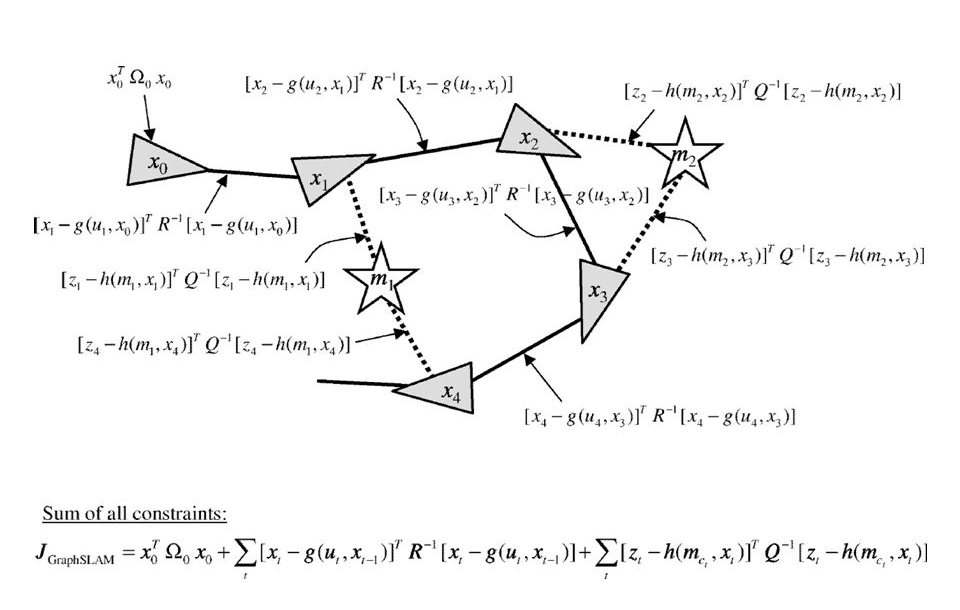

<sub> [The GraphSLAM Algorithm](http://robots.stanford.edu/papers/thrun.graphslam.pdf), S. Thrun & M. Montemerlo [1]</sub></center>

This approach provides an **overdetermined system** that minimize error using the least squares method.

Moreover, memory optimization using variable elimination techniques helps generating maps with way more of features than FastSLAM. In its paper [1], S. Thrun talks about 10<sup>8</sup> features.


The **Real-Time Appearance Based Mapping** (RTAB-Map) is a direct application of the GrapSLAM algorithm using data from odometry and RGBD camera. It uses a **loop closure** process to recognize past location, from current data. This technique is memory optimized for large scale and long term SLAM, so that the loop closure process does not takes longer over time. As the name of the package imply, this process is done in real-time, which makes the memory optimization process decisive to avoid drastic performance drop.

In the following section, a ROS package of RTAB-Map implementation will be described.

### 3. Simulation configuration <a name="1-3"></a>

The RTAB-Map ROS package works with several different sensors, in this set-up, an [RGB-D](http://wiki.ros.org/rtabmap_ros/Tutorials/HandHeldMapping) camera, the Kinect, is used to percieve the depth along with a Hokuyo laser.

Two different simulated environments were used for the experiment. 

The first one provided by Gazebo, is a Kitchen & Dining home presented bellow. It is a 3 rooms home, with a dinner table with 3 seats in the main room, a coffe table on a carpet in an other room and few other furnitures. The walls have different colors to facilitate the feature detection and avoid errors in loop closure.

<center> 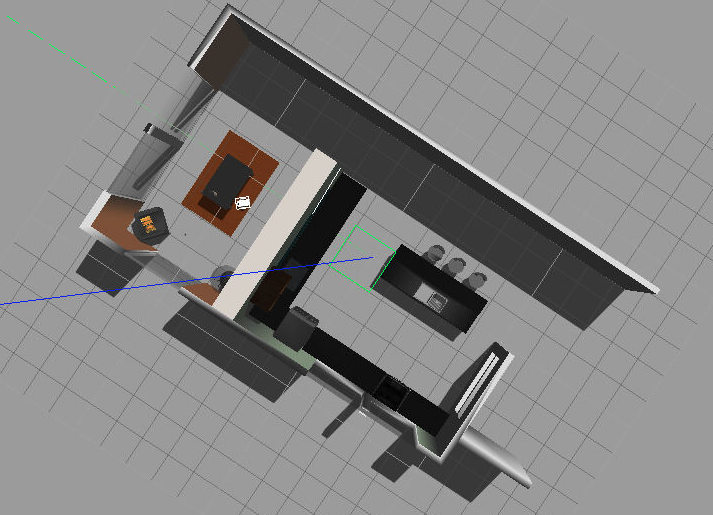

<sub> Kitchen and Dining, Gazebo (C)</sub></center>

The second one, which is a custom environment has some various features, including a stop sign, a shelf and smaller feature were also included (coke can, drill, boxe...). The walls were designed with various colors and textures, and are not all parallel.

<center> 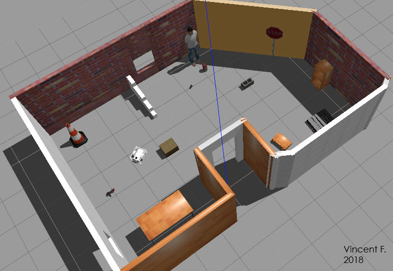

<sub> Custom environment, Vincent F. (C)</sub></center>

The robot was teleoperated with the keyboard to proceed to the simultaneous mapping and localization. A teleop ROS package was used for that purpose.

Few configurations for the RTAB-Map are presented bellow, the major parameters that must be watched are the based link or footprint of the robot that must be used as frame id, and the sensors messages that must be published at the right topic.

The [SURF](https://en.wikipedia.org/wiki/Speeded_up_robust_features) algorithm was used for feature detection in the loop closure process.

```xml
  <arg name="database_path"     default="rtabmap.db"/>
  <arg name="rgb_topic"   default="/camera/rgb/image_raw"/>
  <arg name="depth_topic" default="/camera/depth/image_raw"/>
  <arg name="camera_info_topic" default="/camera/rgb/camera_info"/>
```
```xml
      <!-- Basic RTAB-Map Parameters -->
      <param name="frame_id"            type="string" value="base_footprint"/>
      <param name="odom_frame_id"       type="string" value="odom"/>
      <param name="subscribe_depth"     type="bool"   value="true"/>
      <param name="subscribe_scan"      type="bool"   value="true"/>

      <!-- RTAB-Map Inputs -->
      <remap from="scan"            to="/scan"/>
      <remap from="rgb/image"       to="$(arg rgb_topic)"/>
      <remap from="depth/image"     to="$(arg depth_topic)"/>
      <remap from="rgb/camera_info" to="$(arg camera_info_topic)"/>

      <!-- Loop Closure Detection -->
      <!-- 0=SURF 1=SIFT 2=ORB 3=FAST/FREAK 4=FAST/BRIEF 5=GFTT/FREAK 6=GFTT/BRIEF 7=BRISK 8=GFTT/ORB 9=KAZE -->
      <param name="Kp/DetectorStrategy" type="string" value="0"/> 

      <!-- Maximum visual words per image (bag-of-words) -->
      <param name="Kp/MaxFeatures" type="string" value="400"/>  

      <!-- Used to extract more or less SURF features -->
               <param name="SURF/HessianThreshold" type="string" value="100"/>

      <!-- Loop Closure Constraint -->
      <!-- 0=Visual, 1=ICP (1 requires scan)-->
      <param name="Reg/Strategy" type="string" value="0"/> 

```

The link of the robot used can be observed thanks to the tf library, using the `rosrun tf view_frames` command. The following graph shows the results of such a command while running the RTAP-Map algorithm in the simulated environment.

<center> 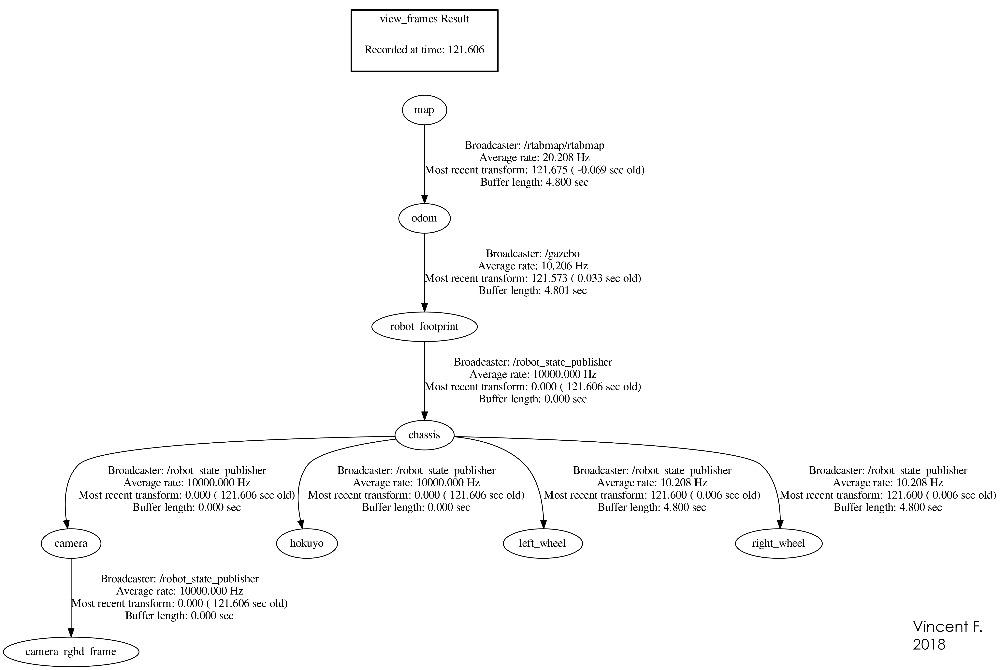

<sub> Frame, Vincent F. 2018 (C)</sub></center>


### 4. Results <a name="1-4"></a>

The teleoperated robot was able to map both simulated environments with accuracy. 

The following screen capture of the first experiment shows on the bottom left, the loop closure detection with the feature matching circle thanks to the SURF algorithm. The trajectory of the robot is represented in cyan on the 3 map map. The wall are well represented and most of the features can be recognized such as the dining table with the 3 seats, and the coffe table. 

<center> 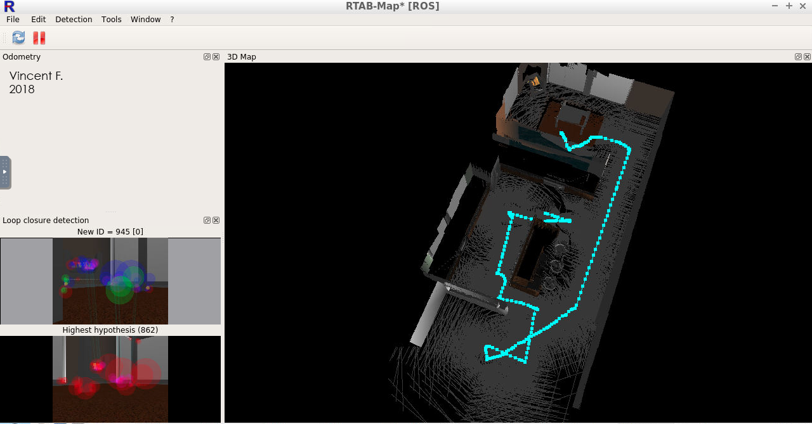

<sub> Kitchen and Dining map observed with RViz, Vincent F. 2018 (C)</sub></center>

<center> 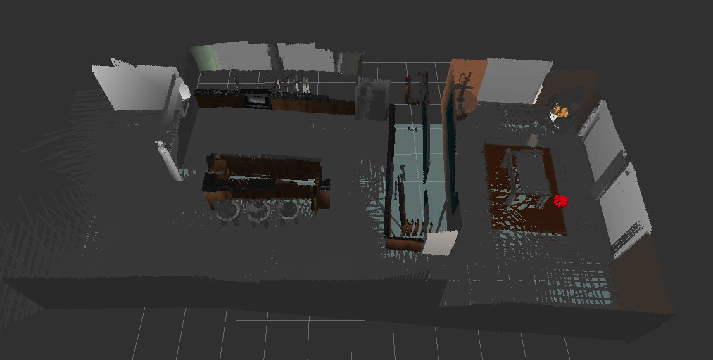 

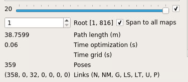


<sub> Kitchen and Dining RTAB-Map, Vincent F. 2018 (C)</sub></center>

For the second experiment, a more massive number of features was detected thanks to the wall texture, as shown bellow, on the bottom left. Some glitches can be observed, on the working cone or on the top left corner of the wall. Yet, the grid map observed thanks to the RTAB-Map database viewer barely shows those errors.

<center> 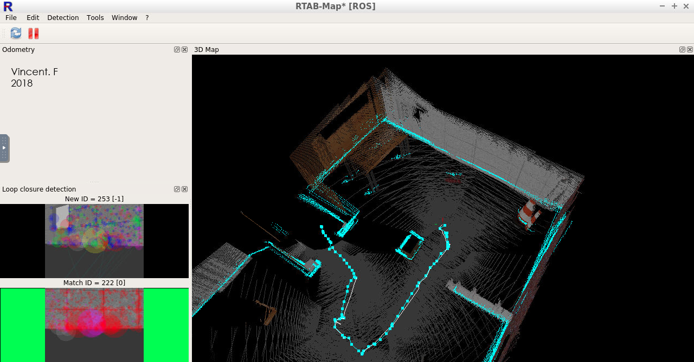

<sub> Custom environment RTAB-Map, Vincent F. 2018 (C)</sub></center>

<center> 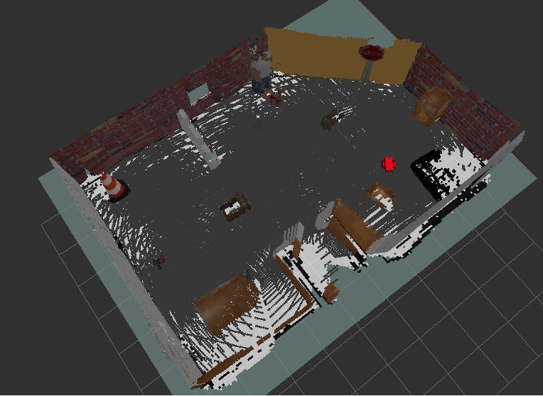

<sub> Custom environment RViz, Vincent F. 2018 (C)</sub></center>

<center> 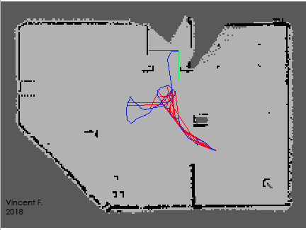 
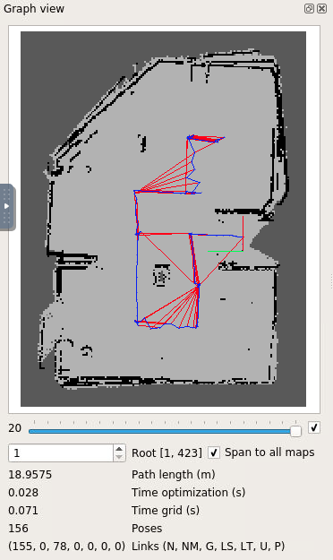

<sub> 2 grid-map of the custom environment with different path, Vincent F. 2018 (C)</sub></center>

It can be noted that for the first test, 32 global loop-closures were registered, and 78 were for the second one. The richness of the features of the second simulated environment with more particularly the wall texture might explain why.


### 5. Discussion <a name="1-5"></a>

It is interresting to notice that another custom environment (_not presented here_) was tested. It was quite alike the one presented here but with only brick walls. The experiment gave a blurry and inaccurate resulting grid map, the loop closure algorithm was actually failing.

This malfunction can be explained by the similarities of the wall texture. Indeed, if the robot was too close to a wall, the SURF algorithm could associate it almost any part of the wall. This limitation was overcome - _as said above_ - by making sure the wall were easily differentiable. Also, while navigating, the strategy was to avoid being too close to obstacles.

Since the robot was teleoperated, the experiment was a little laborious. Using an automated pilot like in the Rover project could have been a way out.

The all experiment was conducted thanks to a GPU provided by Udacity. Some trials on a personal virtual machine were conducted without sucess. Indeed, in order to work in real time, the RTAB-Map ROS package requires a heavy computing GPU processor.  The VM ran on a Lubuntu OS, with 8GB of RAM and 3 cores, and very little GPU.

However, it is possible to implement such algorithm on small robot thanks to adapted GPU like the Jetson TX2 from Nvidia. Without this kind of equipment, other SLAM algorithm should be benchmarked (_Orthogonal SLAM for example_).

## Conclusion <a name="part3"></a>

The SLAM algorithm comes into different forms. It is a very powerfull technique that allows unmanned robots to operate in unknown environment while keeping information about the new environment.

It is therefore crucial for automated vehicule, but even more for the exploration of unfriendly environment. Such an algorithm could help expedition in deep underground, undersea, or even space. It could also help probing in dramatic situation, for example after a cataclysm, for rescue team.