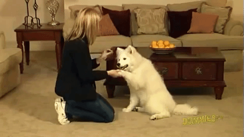
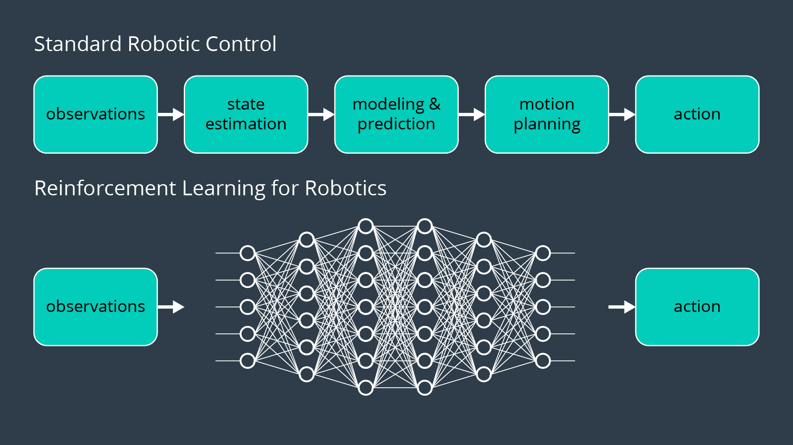
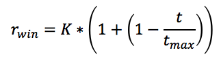
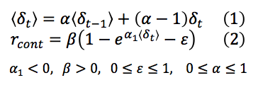
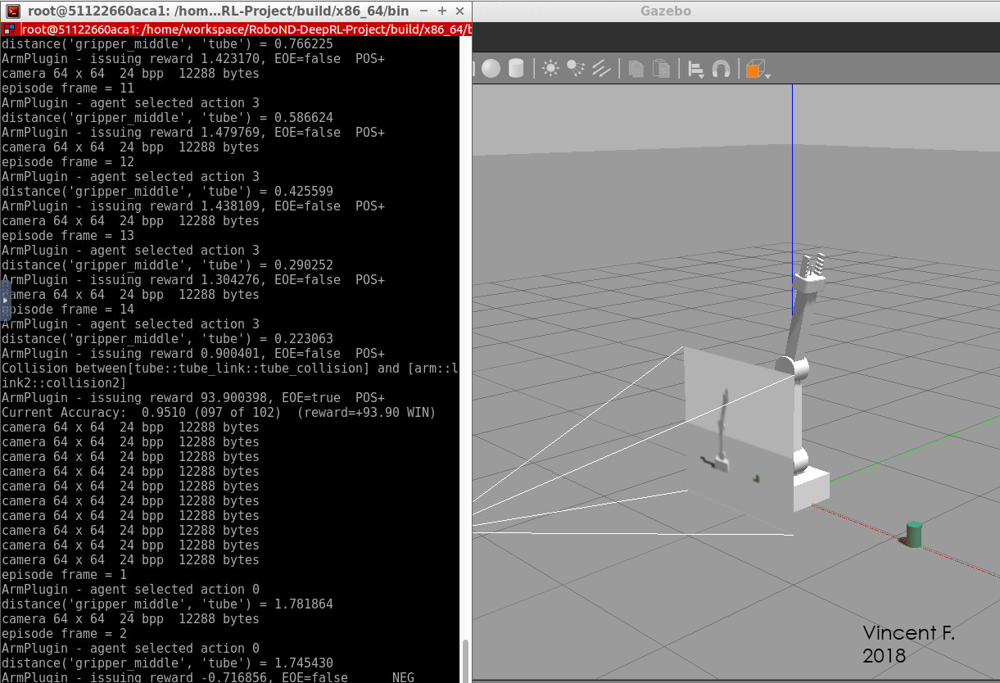
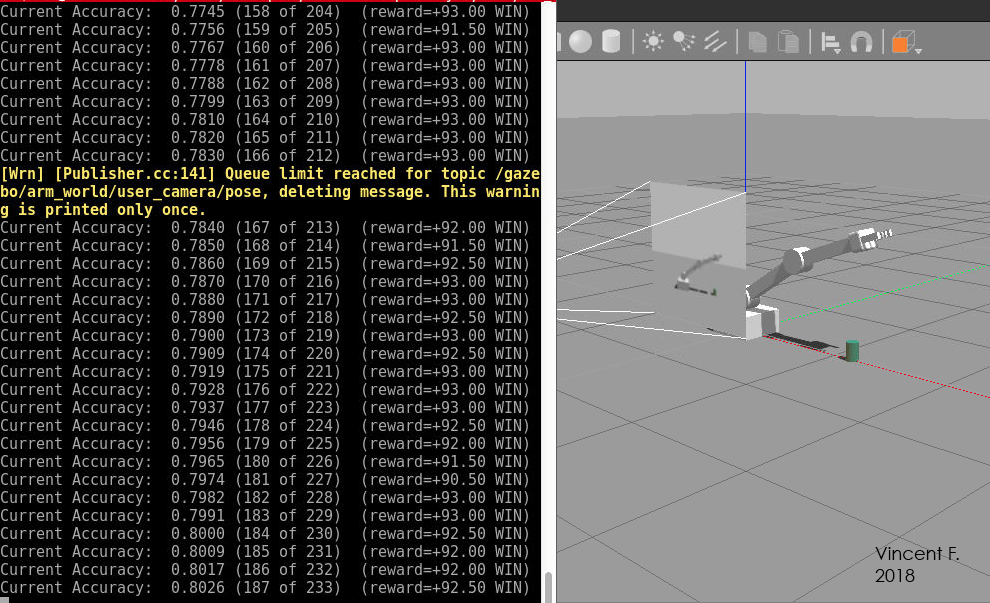
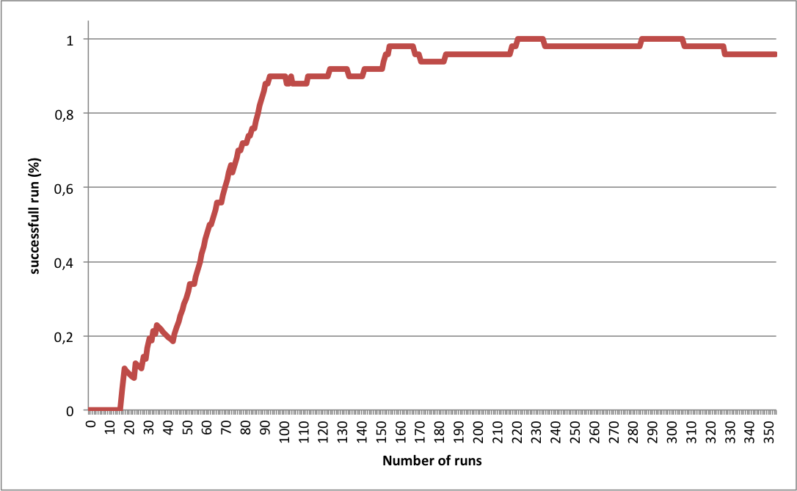

# Project: Deep RL Arm Manipulation

#### Vincent FORTINEAU, PhD. Student at CentraleSupélec & Université Paris-Sud, Paris suburbs, France

#### Project due : 24th October 2018
---


## Goals and steps of the project

* Clone the project here `http://github.com/udacity/RoboND-DeepRL-Project`.
* Build the project using `make` in the build directory, and launch the simulation using `./gazebo-arm.sh` in `x86_64/bin`.
* Subscribe to camera and collision topics.
* Create the DQN Agent.
* Update the velocity and position based control of arm joints
* Create function reward according to the robot behaviour (eg. when it touches the floor, the target, and during its movement).
* Tune the hyperparameters to reach 80% accuracy for touching the target with the end effector, and 90% to touch the target with the arme.


[//]: # (Image References)


#### [Evaluation criteria](https://review.udacity.com/#!/rubrics/1439/view) 

<center>

**Abstract**
</center>

_This report presents an example of Deep Reinforcement Learning (DRL) implementation using **Deep Q-Network** (DQN) algorithm. The goal is to teach a robotic arm with 2 degrees of freedom (DoF), to reach a target object using proper reward functions. The robot is learning in a simulated environment, Gazebo._ 

## Table of Contents

* [Deep Q-Learning](#part1)
	* [1. Introduction](#1-1)
	* [2. Background](#1-2)
	* [3. Reward functions and configurations](#1-3)
		* [Rewards](#1-3-a)
		* [Hyperparameters](#1-3-b)
	* [4. Results](#1-4)
	* [5. Discussion](#1-5)

* [Conclusion](#part3)

## Deep Q-Learning <a name="part1"></a>

### 1. Introduction <a name="1-1"></a>

Men have been domesticating and teaching animal since a least 15.000 years before present, startings with wolves and dingos [[MacHugh D.E. (2017)](https://www.annualreviews.org/doi/10.1146/annurev-animal-022516-022747)]. Teaching a dog can be achieved thanks to rewards, indeed the pet is trying to get as much reward as he can - _up to some limits obviously_. 

Using this past knowledge, we are trying to _teach_ "artificial intelligence" (_this expression must be used with caution, since we are not really dealing with intelligence as we know in animals yet_) to do basic tasks up to more complicated tasks (like playing video games at pro level player, eg. [OpenAI](https://blog.openai.com/dota-2/)).

<center> 

<sub> Teaching a dog with rewards, source: "_Debunking 6 Common Dog Myths_", Cherry</sub></center>

The reinforcement learning process is made through an **agent**, _abstract entity_, that is trying to maximize the reward it recieves for making decisions. This process really fits simulated environments, but a [gap](http://www.cs.utexas.edu/~jphanna/gsl.pdf) often remains between reality and simulation and must be taken into account. 

<center> 

<sub>Reinforcement Learning model ,Udacity (C)</sub></center>

As it is really well summed-up in this class: "_Deep Reinforcement Learning for Robotics is a **paradigm shift**. The basic idea is to start with raw sensor input, define a goal for the robot, and let it figure out, through trial and error, the best way to achieve the goal. In this paradigm, perception, internal state, planning, control, and even sensor and measurement uncertainty, are not explicitly defined. All of those traditional steps between observations (the sensory input) and actionable output are learned by a neural network._" 

For more details on reinforcement learning I would advise reading [Deep Learning in a Nutshell: Reinforcement Learning](https://devblogs.nvidia.com/deep-learning-nutshell-reinforcement-learning/) by Tim Dettmers.

### 2. Background <a name="1-2"></a>

_This part should explain the particular case of deep reinforcement learning... under construction..._

### 3. Reward functions and configurations <a name="1-3"></a>

#### a. Rewards <a name="1-3-a"></a>

First thing that comes to mind is on the first hand to reward the robot for touching the target, and on the other hand to punish it for touching the ground since we want to avoid dammaging the robot. This could be done with a very simple and naive constant, however, the duration of the process should be taken into account.

Therefore, we want to make a reward function inversely proportional to the time spent in the process: 

<center>  </center>

* **_K_** a constant multiplier
* **_t_** the time spent
* **_t<sub>max</sub>_** the maximum duration allowed

It should be notice that, according to the goal, either touching the target with the arm or touching it only with the gripper, the collision is different and can be differenciated thanks to the following snippet:

```C++
#define COLLISION_ITEM   "tube::tube_link::tube_collision"
#define COLLISION_POINT  "arm::gripperbase::gripper_link"

/* collision with the target */
bool collisionCheck = (strcmp(contacts->contact(i).collision1().c_str(), COLLISION_ITEM) == 0);
/* collision with the gripper */
bool collisionCheckGripper = (strcmp(contacts->contact(i).collision2().c_str(), COLLISION_POINT) == 0);
```

When a ground contact with the arm happens, it receives a negative constant reward, since it equally bad if it falls quickly or slowly: 

<center>_r<sub>gnd</sub> = -K_</center>

When the robot takes to long to reach and end of event (EoE) case, an EoE is generated, and the robot takes a negative reward function twice as much as the previous one. We absolutly want to avoid the robot doing nothing or wandering in the air.

**Sparse reward** function makes the learning unbiased but way complicated for the agent, since it needs to explore its environment without continous feedback. It is interresting to provided a **continous reward** according distance between the end effector and the target, to help it understand how to find the target.

<center>  </center>

* Equation **_(1)_** describes a **low pass filter** that smooth the variation of movement. The greater the **_α_** coefficient is, the smoother the result.
* Equation **_(2)_** is the continuous reward function. It is inspired by the time response of a 1<sup>st</sup> order system (eg. RC). The **_ε_** avoid the non moving scenario beeing a local minimum (_by moving the function on the right such as r<sub>cont</sub>(δ=0) < 0_), **_α<sub>1</sub>_** sets the slope (response time), and **_β_** sets the final value.

The main idea that brought equation **_(2)_** was to have an exponential increase of the reward with **_δ_** up to some limit to avoid too quick movement. Moreover, if the robot has a negative **_δ_** the penalty given increases really quickly, discouraging the robot to move away from the target. 

The following table shows the parameters of equation _(1)_ and _(2)_ according to the objective, - _1<sup>st</sup>: touching the target with the arm, 2<sup>nd</sup>: touching the target with the gripper only_:

<center>

| Parameters   | Objective 1| Objective 2 |
|:------------:|:----------:|:-----------:|
|α             | 0.8        |   0.6       |
|ε             | 0.2        |   0.2       |
|α<sub>1</sub> | -4.0       |   -4.0      |
|β             | 1.0        |   4.0       |

<sub>Table 1: function reward parameters</sub>

</center>

_Those parameters were determined by trial and error, some optimization could probably be done with a more rigorous method._

```C++
avgGoalDelta  = (avgGoalDelta * alpha) + (distDelta * (1 - alpha));
rewardHistory = beta * (1.0f - exp(alpha1 * avgGoalDelta) - 0.2f);

```

#### b. Hyperparameters <a name="1-3-b"></a>

The following table gives the hyperparameters that were tunable in this project:

<center>

| Parameters   | Default value | 
|:------------:|:-------------:|
| INPUT_WIDTH  |   512         | For the DNN
| INPUT_HEIGTH |   512         | For the DNN
|   OPTIMIZER  |   "None"      | Gradient descent opt. algorithm
|LEARNING_RATE |    0.0f       | For the DNN
|REPLAY_MEMORY |   10000       | 
|  BATCH_SIZE  |     8         | For the DNN
|  USE_LSTM    |    false      | 
|  LSTM_SIZE   |     32        |
|  REWARD_WIN  |    0.0f       |
|  REWARD_LOSS |   -0.0f       | 
|     GAMMA    |    0.9f       |  discount factor
|   EPS_START  |    0.9f       |  greedy value
|   EPS_END    |    0.05f      |  greedy value
|   EPS_DECAY  |    200        |  greedy value decay rate

<sub>Table 2: List of hyperparameters with their default value</sub>

</center>

It is important to notice that during a learning session, the progress of the robot is stochastic, so even with equivalent hyperparameters, the progess will probably differ between two trials. Therefore, the choice of the parameters made here is quite arbitrary and making it optimal would be tedious for most of them.

The first obvious parameters to change were the input width and height of the Deep Neural Network (DNN). Indeed the picture size is 64x64x3, so reducing those parameters to fit the size would avoid unecessary computation for the DNN.

For the optimizer two choice were tested, "RMSprop" (seen in class) and "Adam", both seem to be the most commonly used in literature. No evidence were found for chosing one over the other, yet **RMSprop** was used for the learning.

Three learning rates were tested between 0.1 and 0.001, 5 trials were done for each of these case. [Table 3](#table-3). present the result for th 2<sup>nd</sup> objective, according to those results, a learning rate of 0.01 was used. In both other case, the robot felt in unpexpected local minimum.

**_ε-greedy_** parameters (Gamma γ, eps_* ε...) define the exploration strategy over a learning session. First ε starts with a value close to 1 to explore the possible actions, and avoid falling in a local minimum. It ends with a value close to 0, since at some point, the robot needs to exploit the learning and explores less to avoid undesired behaviour. The decay define the rate at which ε is going to reach its end value, the more complicated the task the lower this value should be. Default values were kept.

The constant values multiplying the reward function were chosen to be 10 and -10 for the respectively won and loss reward functions. This values are quite subjective, it would have probably been more cautious to normalize all functions to get results between -1.0 and 1.0. This would have made possible the comparison according to reward, and not just according to success - _all success are not worth the same reward_. 

### 4. Results <a name="1-4"></a>

For both objective, results over **95%** were reached eventually. For the first objective, this goal was even reach after only **100 runs**, and around **200 runs** for the second objective. _<sub>(The accuracy is computed on the last 100 runs, not the overall runs)</sub>_

<center> 

<sub> 95% success after 100 runs for the 1<sup>st</sup> objective, Vincent F. (C)</center>

<center> 

<sub> 80% overall success after 230 runs for the 2<sup>nd</sup> objective, Vincent F. (C)</center>

The following graph presents the results of a learning session for the second objective. The percentage of success is presented with a moving average on 50 values. We distinguish 3 phases, the exploration phase, between the 1<sup>st</sup> and the 45<sup>th</sup> run were the robot is still having some random behaviour. The second phase up until the 100<sup>th</sup> run is a transition (_due to the moving average ?_) between the exploration phase and the exploitation one at which a plateau is reached with very few progress.

_It would be insteresting to try to corralate this graph with the evolution of the parameter ε, that is decaying._

<center> 

<sub> Moving average of the successful runs for the gripper task (2<sup>nd</sup> obj.), Vincent F. (C)</center>

<center>

|Learning rate|Average result|Std deviation|
|:-----------:|:------------:|:-----------:|
|0.1          | 0.726        |   0.115     |
|0.01         | 0.198        |   0.185     |
|0.001        | 0.402        |   0.288     |


<sub>Table 3: Result according to the learning rate, 5 trials of 100 runs were conducted for each case</sub> <a name="table-3"></a>

</center>

### 5. Discussion <a name="1-5"></a>

The simple task of reaching a non moving object with a 2 DoF robot arm was achieved with sufficient accuracy after few hundreds of trials in average. This shows the limitation of a basic DQN agent using basic RL algorithm. Adding a single DoF would make the exploration phase more complicated, and moving the target in a 1D or 2D field would make the learning even more tedious. 

The tuning of the parameters proposed here is clearly suboptimal, particle swarm optimization (PSO) technique could be used to try to reach better performances for exmple. The difficulty here is the duration of the similation, in the worst case (time out) a 100 runs could take up to 15 minutes. It would be interesting then to try to accelerate the simulation, to use such techniques.

For complex tasks, it can be usefull and necessary to increase gradually the complexity over the learning, such RL algorithm exists, with for example, what is called curriculum RL ([Curriculum Learning in Reinforcement Learning](https://www.ijcai.org/proceedings/2017/0757.pdf), [Reverse Curriculum Generation for Reinforcement Learning](http://proceedings.mlr.press/v78/florensa17a/florensa17a.pdf)). 

## Conclusion <a name="part3"></a>

The artificial intelligence brought by reinforcement learning has been emerging in the past years. New strategies are being proposed to increase the performances of RL and allow robot and algorithms to learn more and more complicated tasks.

It would be interesting to try implementing a curriculum learning algorithm in this project, replacing the studied robot with a 3, 4, even 7 DoF robots and a moving target.
